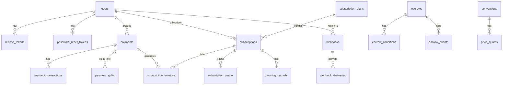
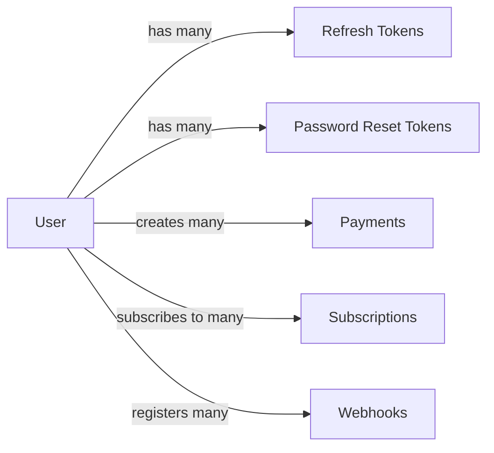
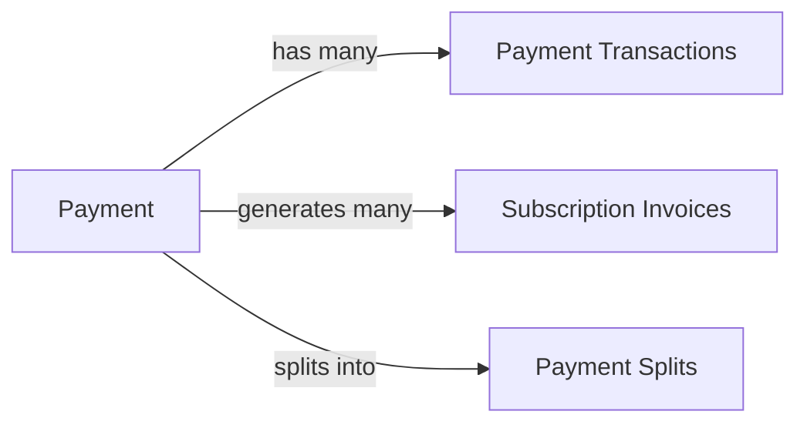
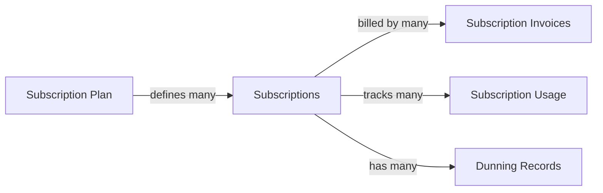

# Paya Data Architecture

## Table of Contents
1. [Database Schema Documentation](#database-schema-documentation)
2. [Data Model Relationships](#data-model-relationships)
3. [Caching Strategies](#caching-strategies)
4. [Message Queue Schemas](#message-queue-schemas)
5. [Data Migration Strategies](#data-migration-strategies)
6. [Data Retention Policies](#data-retention-policies)

## Database Schema Documentation

### Database Overview

**Database:** PostgreSQL 14+  
**Schema:** `public`  
**Character Set:** UTF8  
**Collation:** en_US.UTF-8

### Entity Relationship Diagram



### Tables

#### users

User accounts for authentication and authorization.

| Column | Type | Constraints | Description |
|--------|------|-------------|-------------|
| id | UUID | PK, NOT NULL | User ID |
| email | VARCHAR(255) | UNIQUE, NOT NULL | Email address |
| password | VARCHAR(255) | NOT NULL | Hashed password |
| firstName | VARCHAR(100) | | First name |
| lastName | VARCHAR(100) | | Last name |
| role | ENUM | NOT NULL | User role (USER, ADMIN, MERCHANT) |
| isActive | BOOLEAN | DEFAULT true | Account status |
| emailVerified | BOOLEAN | DEFAULT false | Email verification status |
| createdAt | TIMESTAMP | DEFAULT NOW() | Creation timestamp |
| updatedAt | TIMESTAMP | DEFAULT NOW() | Update timestamp |

**Indexes:**
- `idx_users_email` on `email`
- `idx_users_role` on `role`

#### refresh_tokens

JWT refresh tokens for authentication.

| Column | Type | Constraints | Description |
|--------|------|-------------|-------------|
| id | UUID | PK, NOT NULL | Token ID |
| userId | UUID | FK, NOT NULL | User ID |
| token | VARCHAR(500) | UNIQUE, NOT NULL | Refresh token |
| expiresAt | TIMESTAMP | NOT NULL | Expiration timestamp |
| createdAt | TIMESTAMP | DEFAULT NOW() | Creation timestamp |

**Indexes:**
- `idx_refresh_tokens_userId` on `userId`
- `idx_refresh_tokens_token` on `token`
- `idx_refresh_tokens_expiresAt` on `expiresAt`

#### password_reset_tokens

Password reset tokens for recovery.

| Column | Type | Constraints | Description |
|--------|------|-------------|-------------|
| id | UUID | PK, NOT NULL | Token ID |
| userId | UUID | FK, NOT NULL | User ID |
| token | VARCHAR(500) | UNIQUE, NOT NULL | Reset token |
| expiresAt | TIMESTAMP | NOT NULL | Expiration timestamp |
| used | BOOLEAN | DEFAULT false | Usage status |
| createdAt | TIMESTAMP | DEFAULT NOW() | Creation timestamp |

**Indexes:**
- `idx_password_reset_tokens_userId` on `userId`
- `idx_password_reset_tokens_token` on `token`

#### payments

Payment records.

| Column | Type | Constraints | Description |
|--------|------|-------------|-------------|
| id | UUID | PK, NOT NULL | Payment ID |
| merchantId | UUID | FK, NOT NULL | Merchant ID |
| customerId | UUID | FK, NOT NULL | Customer ID |
| customerEmail | VARCHAR(255) | NOT NULL | Customer email |
| amount | DECIMAL(20,8) | NOT NULL | Payment amount |
| currency | VARCHAR(10) | NOT NULL | Currency code |
| status | ENUM | NOT NULL | Payment status |
| transactionHash | VARCHAR(255) | | Stellar transaction hash |
| description | TEXT | | Payment description |
| metadata | JSONB | | Custom metadata |
| redirectUrl | VARCHAR(500) | | Redirect URL |
| cancelUrl | VARCHAR(500) | | Cancel URL |
| createdAt | TIMESTAMP | DEFAULT NOW() | Creation timestamp |
| updatedAt | TIMESTAMP | DEFAULT NOW() | Update timestamp |

**Indexes:**
- `idx_payments_merchantId` on `merchantId`
- `idx_payments_customerId` on `customerId`
- `idx_payments_status` on `status`
- `idx_payments_createdAt` on `createdAt`
- `idx_payments_transactionHash` on `transactionHash`

#### payment_transactions

Stellar transaction details.

| Column | Type | Constraints | Description |
|--------|------|-------------|-------------|
| id | UUID | PK, NOT NULL | Transaction ID |
| paymentId | UUID | FK, NOT NULL | Payment ID |
| transactionHash | VARCHAR(255) | UNIQUE, NOT NULL | Transaction hash |
| stellarAccountId | VARCHAR(255) | | Stellar account |
| amount | DECIMAL(20,8) | NOT NULL | Transaction amount |
| fee | DECIMAL(20,8) | | Transaction fee |
| memo | VARCHAR(255) | | Transaction memo |
| status | ENUM | NOT NULL | Transaction status |
| submittedAt | TIMESTAMP | | Submission timestamp |
| confirmedAt | TIMESTAMP | | Confirmation timestamp |

**Indexes:**
- `idx_payment_transactions_paymentId` on `paymentId`
- `idx_payment_transactions_transactionHash` on `transactionHash`

#### subscription_plans

Subscription plan definitions.

| Column | Type | Constraints | Description |
|--------|------|-------------|-------------|
| id | UUID | PK, NOT NULL | Plan ID |
| merchantId | UUID | FK, NOT NULL | Merchant ID |
| name | VARCHAR(255) | NOT NULL | Plan name |
| amount | DECIMAL(20,8) | NOT NULL | Plan amount |
| currency | VARCHAR(10) | NOT NULL | Currency code |
| billingInterval | ENUM | NOT NULL | Billing interval |
| trialPeriodDays | INTEGER | DEFAULT 0 | Trial period |
| gracePeriodDays | INTEGER | DEFAULT 0 | Grace period |
| lateFeePercentage | DECIMAL(5,2) | DEFAULT 0 | Late fee percentage |
| maxRetryAttempts | INTEGER | DEFAULT 3 | Max retry attempts |
| prorateOnUpgrade | BOOLEAN | DEFAULT true | Prorate on upgrade |
| prorateOnDowngrade | BOOLEAN | DEFAULT true | Prorate on downgrade |
| status | ENUM | NOT NULL | Plan status |
| features | JSONB | | Plan features |
| limits | JSONB | | Plan limits |
| metadata | JSONB | | Custom metadata |
| createdAt | TIMESTAMP | DEFAULT NOW() | Creation timestamp |
| updatedAt | TIMESTAMP | DEFAULT NOW() | Update timestamp |

**Indexes:**
- `idx_subscription_plans_merchantId` on `merchantId`
- `idx_subscription_plans_status` on `status`

#### subscriptions

Active subscriptions.

| Column | Type | Constraints | Description |
|--------|------|-------------|-------------|
| id | UUID | PK, NOT NULL | Subscription ID |
| merchantId | UUID | FK, NOT NULL | Merchant ID |
| customerId | UUID | FK, NOT NULL | Customer ID |
| customerEmail | VARCHAR(255) | NOT NULL | Customer email |
| planId | UUID | FK, NOT NULL | Plan ID |
| status | ENUM | NOT NULL | Subscription status |
| currentAmount | DECIMAL(20,8) | NOT NULL | Current amount |
| currency | VARCHAR(10) | NOT NULL | Currency code |
| trialStart | TIMESTAMP | | Trial start |
| trialEnd | TIMESTAMP | | Trial end |
| currentPeriodStart | TIMESTAMP | NOT NULL | Period start |
| currentPeriodEnd | TIMESTAMP | NOT NULL | Period end |
| cancelAtPeriodEnd | BOOLEAN | DEFAULT false | Cancel at period end |
| cancelAt | TIMESTAMP | | Cancel at |
| canceledAt | TIMESTAMP | | Canceled at |
| pausedAt | TIMESTAMP | | Paused at |
| resumeAt | TIMESTAMP | | Resume at |
| billingCycleCount | INTEGER | DEFAULT 0 | Billing cycle count |
| failedPaymentCount | INTEGER | DEFAULT 0 | Failed payment count |
| lastPaymentAt | TIMESTAMP | | Last payment at |
| nextPaymentAt | TIMESTAMP | NOT NULL | Next payment at |
| metadata | JSONB | | Custom metadata |
| customFields | JSONB | | Custom fields |
| createdAt | TIMESTAMP | DEFAULT NOW() | Creation timestamp |
| updatedAt | TIMESTAMP | DEFAULT NOW() | Update timestamp |

**Indexes:**
- `idx_subscriptions_merchantId` on `merchantId`
- `idx_subscriptions_customerId` on `customerId`
- `idx_subscriptions_planId` on `planId`
- `idx_subscriptions_status` on `status`
- `idx_subscriptions_nextPaymentAt` on `nextPaymentAt`

#### subscription_invoices

Subscription billing invoices.

| Column | Type | Constraints | Description |
|--------|------|-------------|-------------|
| id | UUID | PK, NOT NULL | Invoice ID |
| subscriptionId | UUID | FK, NOT NULL | Subscription ID |
| merchantId | UUID | FK, NOT NULL | Merchant ID |
| customerId | UUID | FK, NOT NULL | Customer ID |
| planId | UUID | FK, NOT NULL | Plan ID |
| status | ENUM | NOT NULL | Invoice status |
| type | ENUM | NOT NULL | Invoice type |
| subtotal | DECIMAL(20,8) | NOT NULL | Subtotal |
| taxAmount | DECIMAL(20,8) | DEFAULT 0 | Tax amount |
| discountAmount | DECIMAL(20,8) | DEFAULT 0 | Discount amount |
| total | DECIMAL(20,8) | NOT NULL | Total |
| currency | VARCHAR(10) | NOT NULL | Currency code |
| dueDate | TIMESTAMP | NOT NULL | Due date |
| paidAt | TIMESTAMP | | Paid at |
| failedAt | TIMESTAMP | | Failed at |
| voidedAt | TIMESTAMP | | Voided at |
| refundedAt | TIMESTAMP | | Refunded at |
| retryCount | INTEGER | DEFAULT 0 | Retry count |
| nextRetryAt | TIMESTAMP | | Next retry at |
| errorMessage | TEXT | | Error message |
| paymentMethodId | VARCHAR(255) | | Payment method ID |
| transactionHash | VARCHAR(255) | | Transaction hash |
| lineItems | JSONB | | Line items |
| prorationDetails | JSONB | | Proration details |
| metadata | JSONB | | Custom metadata |
| createdAt | TIMESTAMP | DEFAULT NOW() | Creation timestamp |
| updatedAt | TIMESTAMP | DEFAULT NOW() | Update timestamp |

**Indexes:**
- `idx_subscription_invoices_subscriptionId` on `subscriptionId`
- `idx_subscription_invoices_merchantId` on `merchantId`
- `idx_subscription_invoices_status` on `status`
- `idx_subscription_invoices_dueDate` on `dueDate`

#### subscription_usage

Usage tracking for metered billing.

| Column | Type | Constraints | Description |
|--------|------|-------------|-------------|
| id | UUID | PK, NOT NULL | Usage ID |
| subscriptionId | UUID | FK, NOT NULL | Subscription ID |
| metricId | VARCHAR(255) | NOT NULL | Metric ID |
| metricName | VARCHAR(255) | NOT NULL | Metric name |
| metricUnit | VARCHAR(50) | NOT NULL | Metric unit |
| quantity | DECIMAL(20,8) | NOT NULL | Quantity |
| unitPrice | DECIMAL(20,8) | NOT NULL | Unit price |
| amount | DECIMAL(20,8) | NOT NULL | Amount |
| currency | VARCHAR(10) | NOT NULL | Currency code |
| periodStart | TIMESTAMP | NOT NULL | Period start |
| periodEnd | TIMESTAMP | NOT NULL | Period end |
| metadata | JSONB | | Custom metadata |
| createdAt | TIMESTAMP | DEFAULT NOW() | Creation timestamp |
| updatedAt | TIMESTAMP | DEFAULT NOW() | Update timestamp |

**Indexes:**
- `idx_subscription_usage_subscriptionId_period` on `subscriptionId, periodStart, periodEnd`
- `idx_subscription_usage_subscriptionId_metric` on `subscriptionId, metricId`

#### dunning_records

Failed payment tracking for subscriptions.

| Column | Type | Constraints | Description |
|--------|------|-------------|-------------|
| id | UUID | PK, NOT NULL | Dunning ID |
| subscriptionId | UUID | FK, NOT NULL | Subscription ID |
| invoiceId | UUID | FK, NOT NULL | Invoice ID |
| merchantId | UUID | FK, NOT NULL | Merchant ID |
| customerId | UUID | FK, NOT NULL | Customer ID |
| status | ENUM | NOT NULL | Dunning status |
| action | ENUM | NOT NULL | Dunning action |
| attemptNumber | INTEGER | NOT NULL | Attempt number |
| scheduledAt | TIMESTAMP | NOT NULL | Scheduled at |
| executedAt | TIMESTAMP | | Executed at |
| errorMessage | TEXT | | Error message |
| resolvedAt | TIMESTAMP | | Resolved at |
| retryConfig | JSONB | | Retry configuration |
| metadata | JSONB | | Custom metadata |
| createdAt | TIMESTAMP | DEFAULT NOW() | Creation timestamp |
| updatedAt | TIMESTAMP | DEFAULT NOW() | Update timestamp |

**Indexes:**
- `idx_dunning_records_subscriptionId` on `subscriptionId`
- `idx_dunning_records_invoiceId` on `invoiceId`
- `idx_dunning_records_status` on `status`

#### webhooks

Webhook registrations.

| Column | Type | Constraints | Description |
|--------|------|-------------|-------------|
| id | UUID | PK, NOT NULL | Webhook ID |
| merchantId | UUID | FK, NOT NULL | Merchant ID |
| url | VARCHAR(500) | NOT NULL | Webhook URL |
| events | TEXT[] | NOT NULL | Event types |
| status | ENUM | NOT NULL | Webhook status |
| secret | VARCHAR(255) | NOT NULL | Webhook secret |
| failureCount | INTEGER | DEFAULT 0 | Failure count |
| lastSuccessAt | TIMESTAMP | | Last success at |
| lastFailureAt | TIMESTAMP | | Last failure at |
| maxRetries | INTEGER | DEFAULT 3 | Max retries |
| retryDelay | INTEGER | DEFAULT 5000 | Retry delay (ms) |
| metadata | JSONB | | Custom metadata |
| createdAt | TIMESTAMP | DEFAULT NOW() | Creation timestamp |
| updatedAt | TIMESTAMP | DEFAULT NOW() | Update timestamp |

**Indexes:**
- `idx_webhooks_merchantId_status` on `merchantId, status`
- `idx_webhooks_merchantId_events` on `merchantId, events`

#### webhook_deliveries

Webhook delivery tracking.

| Column | Type | Constraints | Description |
|--------|------|-------------|-------------|
| id | UUID | PK, NOT NULL | Delivery ID |
| webhookId | UUID | FK, NOT NULL | Webhook ID |
| merchantId | UUID | FK, NOT NULL | Merchant ID |
| eventType | VARCHAR(255) | NOT NULL | Event type |
| payload | JSONB | NOT NULL | Event payload |
| status | ENUM | NOT NULL | Delivery status |
| statusCode | INTEGER | | HTTP status code |
| responseTime | INTEGER | | Response time (ms) |
| responseBody | TEXT | | Response body |
| errorMessage | TEXT | | Error message |
| attemptNumber | INTEGER | DEFAULT 0 | Attempt number |
| nextRetryAt | TIMESTAMP | | Next retry at |
| deliveredAt | TIMESTAMP | | Delivered at |
| headers | JSONB | | Request headers |
| createdAt | TIMESTAMP | DEFAULT NOW() | Creation timestamp |

**Indexes:**
- `idx_webhook_deliveries_webhookId_status` on `webhookId, status`
- `idx_webhook_deliveries_merchantId_eventType` on `merchantId, eventType`
- `idx_webhook_deliveries_status_nextRetryAt` on `status, nextRetryAt`

#### email_logs

Email notification tracking.

| Column | Type | Constraints | Description |
|--------|------|-------------|-------------|
| id | UUID | PK, NOT NULL | Email ID |
| merchantId | UUID | FK, NOT NULL | Merchant ID |
| recipientEmail | VARCHAR(255) | NOT NULL | Recipient email |
| recipientName | VARCHAR(255) | NOT NULL | Recipient name |
| template | VARCHAR(255) | NOT NULL | Email template |
| templateData | JSONB | NOT NULL | Template data |
| subject | VARCHAR(500) | NOT NULL | Email subject |
| status | ENUM | NOT NULL | Email status |
| provider | VARCHAR(50) | | Email provider |
| providerMessageId | VARCHAR(255) | | Provider message ID |
| errorMessage | TEXT | | Error message |
| sentAt | TIMESTAMP | | Sent at |
| deliveredAt | TIMESTAMP | | Delivered at |
| openedAt | TIMESTAMP | | Opened at |
| clickedAt | TIMESTAMP | | Clicked at |
| retryCount | INTEGER | DEFAULT 0 | Retry count |
| metadata | JSONB | | Custom metadata |
| createdAt | TIMESTAMP | DEFAULT NOW() | Creation timestamp |

**Indexes:**
- `idx_email_logs_merchantId_status` on `merchantId, status`
- `idx_email_logs_recipientEmail_status` on `recipientEmail, status`
- `idx_email_logs_status_createdAt` on `status, createdAt`

#### escrows

Escrow payment records.

| Column | Type | Constraints | Description |
|--------|------|-------------|-------------|
| id | UUID | PK, NOT NULL | Escrow ID |
| merchantId | UUID | FK, NOT NULL | Merchant ID |
| customerId | UUID | FK, NOT NULL | Customer ID |
| amount | DECIMAL(20,8) | NOT NULL | Escrow amount |
| currency | VARCHAR(10) | NOT NULL | Currency code |
| status | ENUM | NOT NULL | Escrow status |
| transactionHash | VARCHAR(255) | | Transaction hash |
| releaseCondition | JSONB | NOT NULL | Release condition |
| holdPeriod | INTEGER | NOT NULL | Hold period (days) |
| releaseAt | TIMESTAMP | | Release at |
| releasedAt | TIMESTAMP | | Released at |
| cancelledAt | TIMESTAMP | | Cancelled at |
| metadata | JSONB | | Custom metadata |
| createdAt | TIMESTAMP | DEFAULT NOW() | Creation timestamp |
| updatedAt | TIMESTAMP | DEFAULT NOW() | Update timestamp |

**Indexes:**
- `idx_escrows_merchantId` on `merchantId`
- `idx_escrows_customerId` on `customerId`
- `idx_escrows_status` on `status`
- `idx_escrows_releaseAt` on `releaseAt`

#### escrow_conditions

Escrow release conditions.

| Column | Type | Constraints | Description |
|--------|------|-------------|-------------|
| id | UUID | PK, NOT NULL | Condition ID |
| escrowId | UUID | FK, NOT NULL | Escrow ID |
| conditionType | VARCHAR(50) | NOT NULL | Condition type |
| conditionData | JSONB | NOT NULL | Condition data |
| status | ENUM | NOT NULL | Condition status |
| evaluatedAt | TIMESTAMP | | Evaluated at |
| createdAt | TIMESTAMP | DEFAULT NOW() | Creation timestamp |

**Indexes:**
- `idx_escrow_conditions_escrowId` on `escrowId`
- `idx_escrow_conditions_status` on `status`

#### escrow_events

Escrow event log.

| Column | Type | Constraints | Description |
|--------|------|-------------|-------------|
| id | UUID | PK, NOT NULL | Event ID |
| escrowId | UUID | FK, NOT NULL | Escrow ID |
| eventType | VARCHAR(50) | NOT NULL | Event type |
| eventData | JSONB | NOT NULL | Event data |
| createdAt | TIMESTAMP | DEFAULT NOW() | Creation timestamp |

**Indexes:**
- `idx_escrow_events_escrowId` on `escrowId`
- `idx_escrow_events_createdAt` on `createdAt`

#### payment_splits

Payment split configurations.

| Column | Type | Constraints | Description |
|--------|------|-------------|-------------|
| id | UUID | PK, NOT NULL | Split ID |
| merchantId | UUID | FK, NOT NULL | Merchant ID |
| paymentId | UUID | FK, NOT NULL | Payment ID |
| status | ENUM | NOT NULL | Split status |
| totalAmount | DECIMAL(20,8) | NOT NULL | Total amount |
| currency | VARCHAR(10) | NOT NULL | Currency code |
| splitType | ENUM | NOT NULL | Split type |
| metadata | JSONB | | Custom metadata |
| createdAt | TIMESTAMP | DEFAULT NOW() | Creation timestamp |
| updatedAt | TIMESTAMP | DEFAULT NOW() | Update timestamp |

**Indexes:**
- `idx_payment_splits_merchantId` on `merchantId`
- `idx_payment_splits_paymentId` on `paymentId`
- `idx_payment_splits_status` on `status`

#### split_recipients

Split recipient details.

| Column | Type | Constraints | Description |
|--------|------|-------------|-------------|
| id | UUID | PK, NOT NULL | Recipient ID |
| splitId | UUID | FK, NOT NULL | Split ID |
| recipientId | VARCHAR(255) | NOT NULL | Recipient ID |
| recipientType | ENUM | NOT NULL | Recipient type |
| amount | DECIMAL(20,8) | NOT NULL | Amount |
| percentage | DECIMAL(5,2) | | Percentage |
| stellarAddress | VARCHAR(255) | | Stellar address |
| status | ENUM | NOT NULL | Recipient status |
| transactionHash | VARCHAR(255) | | Transaction hash |
| paidAt | TIMESTAMP | | Paid at |
| metadata | JSONB | | Custom metadata |
| createdAt | TIMESTAMP | DEFAULT NOW() | Creation timestamp |
| updatedAt | TIMESTAMP | DEFAULT NOW() | Update timestamp |

**Indexes:**
- `idx_split_recipients_splitId` on `splitId`
- `idx_split_recipients_recipientId` on `recipientId`
- `idx_split_recipients_status` on `status`

#### conversions

Currency conversion records.

| Column | Type | Constraints | Description |
|--------|------|-------------|-------------|
| id | UUID | PK, NOT NULL | Conversion ID |
| merchantId | UUID | FK, NOT NULL | Merchant ID |
| fromCurrency | VARCHAR(10) | NOT NULL | From currency |
| toCurrency | VARCHAR(10) | NOT NULL | To currency |
| fromAmount | DECIMAL(20,8) | NOT NULL | From amount |
| toAmount | DECIMAL(20,8) | NOT NULL | To amount |
| rate | DECIMAL(20,8) | NOT NULL | Exchange rate |
| status | ENUM | NOT NULL | Conversion status |
| transactionHash | VARCHAR(255) | | Transaction hash |
| dexUsed | VARCHAR(50) | | DEX used |
| slippage | DECIMAL(5,2) | | Slippage percentage |
| fees | DECIMAL(20,8) | | Fees |
| metadata | JSONB | | Custom metadata |
| createdAt | TIMESTAMP | DEFAULT NOW() | Creation timestamp |
| updatedAt | TIMESTAMP | DEFAULT NOW() | Update timestamp |

**Indexes:**
- `idx_conversions_merchantId` on `merchantId`
- `idx_conversions_fromToCurrency` on `fromCurrency, toCurrency`
- `idx_conversions_status` on `status`
- `idx_conversions_createdAt` on `createdAt`

#### price_quotes

Price quote records.

| Column | Type | Constraints | Description |
|--------|------|-------------|-------------|
| id | UUID | PK, NOT NULL | Quote ID |
| conversionId | UUID | FK, NOT NULL | Conversion ID |
| fromCurrency | VARCHAR(10) | NOT NULL | From currency |
| toCurrency | VARCHAR(10) | NOT NULL | To currency |
| price | DECIMAL(20,8) | NOT NULL | Price |
| source | VARCHAR(50) | NOT NULL | Price source |
| expiresAt | TIMESTAMP | NOT NULL | Expires at |
| createdAt | TIMESTAMP | DEFAULT NOW() | Creation timestamp |

**Indexes:**
- `idx_price_quotes_conversionId` on `conversionId`
- `idx_price_quotes_fromToCurrency` on `fromCurrency, toCurrency`
- `idx_price_quotes_expiresAt` on `expiresAt`

## Data Model Relationships

### User Relationships



### Payment Relationships



### Subscription Relationships



### Webhook Relationships


## Caching Strategies

### Redis Caching Layers

#### Session Cache

**Purpose:** Store user sessions and authentication tokens

**Key Pattern:** `session:{userId}`

**TTL:** 1 hour

**Example:**
```typescript
await redis.setex(`session:${userId}`, 3600, JSON.stringify(sessionData));
```

#### Payment Cache

**Purpose:** Cache frequently accessed payments

**Key Pattern:** `payment:{paymentId}`

**TTL:** 5 minutes

**Example:**
```typescript
await redis.setex(`payment:${paymentId}`, 300, JSON.stringify(payment));
```

#### Price Cache

**Purpose:** Cache currency prices

**Key Pattern:** `price:{fromCurrency}:{toCurrency}`

**TTL:** 30 seconds

**Example:**
```typescript
await redis.setex(`price:XLM:USD`, 30, JSON.stringify({ price: 0.15 }));
```

#### Rate Limit Cache

**Purpose:** Track API rate limits

**Key Pattern:** `ratelimit:{userId}:{endpoint}`

**TTL:** 1 minute

**Example:**
```typescript
await redis.incr(`ratelimit:${userId}:${endpoint}`);
await redis.expire(`ratelimit:${userId}:${endpoint}`, 60);
```

### Cache Invalidation Strategies

#### Time-Based Invalidation

**Pattern:** Set TTL on cache entries

**Use Case:** Frequently changing data

```typescript
await redis.setex(key, ttl, value);
```

#### Event-Based Invalidation

**Pattern:** Invalidate on data changes

**Use Case:** Critical data consistency

```typescript
async function updatePayment(paymentId, data) {
  await this.paymentRepository.update(paymentId, data);
  await this.redis.del(`payment:${paymentId}`);
}
```

#### Write-Through Cache

**Pattern:** Update cache on write

**Use Case:** Read-heavy workloads

```typescript
async function getPayment(paymentId) {
  let payment = await this.redis.get(`payment:${paymentId}`);
  
  if (!payment) {
    payment = await this.paymentRepository.findOne({ where: { id: paymentId } });
    await this.redis.setex(`payment:${paymentId}`, 300, JSON.stringify(payment));
  }
  
  return JSON.parse(payment);
}
```

#### Cache Aside

**Pattern:** Load cache on miss

**Use Case:** General purpose caching

```typescript
async function getPayment(paymentId) {
  const cached = await this.redis.get(`payment:${paymentId}`);
  
  if (cached) {
    return JSON.parse(cached);
  }
  
  const payment = await this.paymentRepository.findOne({ where: { id: paymentId } });
  await this.redis.setex(`payment:${paymentId}`, 300, JSON.stringify(payment));
  
  return payment;
}
```

### Cache Warming

**Strategy:** Pre-load frequently accessed data

**Implementation:**
```typescript
async function warmCache() {
  const popularPayments = await this.paymentRepository.find({
    where: { status: 'COMPLETED' },
    order: { createdAt: 'DESC' },
    take: 100,
  });

  for (const payment of popularPayments) {
    await this.redis.setex(
      `payment:${payment.id}`,
      300,
      JSON.stringify(payment)
    );
  }
}
```

## Message Queue Schemas

### Bull Queue Job Schemas

#### Payment Queue

**Queue Name:** `payment-processing`

**Job Schema:**
```typescript
{
  jobId: string;
  name: 'process-payment';
  data: {
    paymentId: string;
    amount: number;
    currency: string;
    merchantId: string;
    customerId: string;
  };
  opts: {
    attempts: 3;
    backoff: {
      type: 'exponential';
      delay: 5000;
    };
  };
}
```

#### Subscription Billing Queue

**Queue Name:** `subscription-billing`

**Job Schema:**
```typescript
{
  jobId: string;
  name: 'bill-subscription';
  data: {
    subscriptionId: string;
    planId: string;
    customerId: string;
    amount: number;
    currency: string;
  };
  opts: {
    attempts: 3;
    backoff: {
      type: 'exponential';
      delay: 10000;
    };
  };
}
```

#### Webhook Delivery Queue

**Queue Name:** `webhook-delivery`

**Job Schema:**
```typescript
{
  jobId: string;
  name: 'deliver-webhook';
  data: {
    deliveryId: string;
    webhookId: string;
    url: string;
    secret: string;
    eventType: string;
    payload: object;
  };
  opts: {
    attempts: 5;
    backoff: {
      type: 'exponential';
      delay: 5000;
    };
  };
}
```

#### Email Queue

**Queue Name:** `email-delivery`

**Job Schema:**
```typescript
{
  jobId: string;
  name: 'send-email';
  data: {
    emailId: string;
    recipientEmail: string;
    recipientName: string;
    template: string;
    templateData: object;
    subject: string;
  };
  opts: {
    attempts: 3;
    backoff: {
      type: 'exponential';
      delay: 5000;
    };
  };
}
```

## Data Migration Strategies

### TypeORM Migrations

#### Generating Migrations

```bash
npm run migration:generate -- -n MigrationName
```

#### Running Migrations

```bash
npm run migration:run
```

#### Reverting Migrations

```bash
npm run migration:revert
```

### Migration Best Practices

#### 1. Backward Compatible Changes

```typescript
// Add new column with default value
@Column({ nullable: true })
newField: string;
```

#### 2. Data Migration Scripts

```typescript
// Migration file
export class AddNewField1640000000000 implements MigrationInterface {
  public async up(queryRunner: QueryRunner): Promise<void> {
    await queryRunner.addColumn('payments', 'newField', new TableColumn({
      name: 'newField',
      type: 'varchar(255)',
      isNullable: true,
    }));

    // Migrate existing data
    await queryRunner.query(`
      UPDATE payments 
      SET newField = 'default_value' 
      WHERE newField IS NULL
    `);
  }

  public async down(queryRunner: QueryRunner): Promise<void> {
    await queryRunner.dropColumn('payments', 'newField');
  }
}
```

#### 3. Index Creation

```typescript
// Create index concurrently
await queryRunner.query(`
  CREATE INDEX CONCURRENTLY idx_payments_status 
  ON payments(status)
`);
```

#### 4. Large Table Operations

```typescript
// Batch processing for large tables
const batchSize = 1000;
let offset = 0;

while (true) {
  const records = await queryRunner.query(`
    SELECT id FROM payments 
    LIMIT ${batchSize} OFFSET ${offset}
  `);

  if (records.length === 0) break;

  for (const record of records) {
    // Process record
  }

  offset += batchSize;
}
```

### Rollback Strategy

#### 1. Database Backups

```bash
# Before migration
pg_dump -U postgres paya > backup_pre_migration.sql
```

#### 2. Dry Run

```typescript
// Test migration on staging first
if (process.env.NODE_ENV === 'production') {
  throw new Error('Run on staging first');
}
```

#### 3. Revert Scripts

```typescript
// Always provide down method
public async down(queryRunner: QueryRunner): Promise<void> {
  // Revert changes
}
```

## Data Retention Policies

### Retention Periods

| Data Type | Retention Period | Rationale |
|------------|------------------|-----------|
| Payment Records | 7 years | Financial compliance |
| Subscription Records | 7 years | Financial compliance |
| Webhook Deliveries | 90 days | Operational needs |
| Email Logs | 1 year | Compliance |
| Audit Logs | 7 years | Compliance |
| Error Logs | 90 days | Operational needs |
| Access Logs | 1 year | Security |
| Session Data | 24 hours | Security |

### Data Archival Strategy

#### 1. Automated Archival

```typescript
// Archive old payments
async function archiveOldPayments() {
  const cutoffDate = new Date();
  cutoffDate.setFullYear(cutoffDate.getFullYear() - 7);

  const oldPayments = await this.paymentRepository.find({
    where: {
      createdAt: LessThan(cutoffDate),
      status: In(['COMPLETED', 'REFUNDED', 'CANCELLED']),
    },
  });

  // Move to archive storage
  for (const payment of oldPayments) {
    await this.archiveStorage.save(payment);
    await this.paymentRepository.remove(payment);
  }
}
```

#### 2. Cold Storage

```typescript
// Move to S3 Glacier
async function moveToColdStorage(data) {
  await s3.putObject({
    Bucket: 'paya-archive',
    Key: `payments/${data.id}`,
    StorageClass: 'GLACIER',
    Body: JSON.stringify(data),
  });
}
```

### Data Deletion

#### 1. GDPR Compliance

```typescript
async function deleteUserData(userId) {
  // Delete user
  await this.userRepository.delete({ id: userId });

  // Anonymize payments
  await this.paymentRepository.update(
    { customerId: userId },
    { customerId: 'ANONYMIZED' }
  );

  // Delete sensitive data
  await this.refreshTokenRepository.delete({ userId });
}
```

#### 2. Soft Delete

```typescript
// Mark as deleted instead of hard delete
@Column({ default: false })
isDeleted: boolean;

@Column({ nullable: true })
deletedAt: Date;
```

### Data Backup Strategy

#### 1. Full Backups

```bash
# Daily full backup
pg_dump -U postgres paya > backup_$(date +%Y%m%d).sql
```

#### 2. Incremental Backups

```bash
# WAL archiving
archive_mode = on
archive_command = 'cp %p /var/lib/postgresql/archive/%f'
```

#### 3. Point-in-Time Recovery

```bash
# Restore to specific time
pg_restore -U postgres -d paya --clean backup.sql
```

## Support

For data architecture questions, contact:
- **Database Team**: database@paya.io
- **Data Engineering**: data@paya.io
- **Slack**: #paya-data
