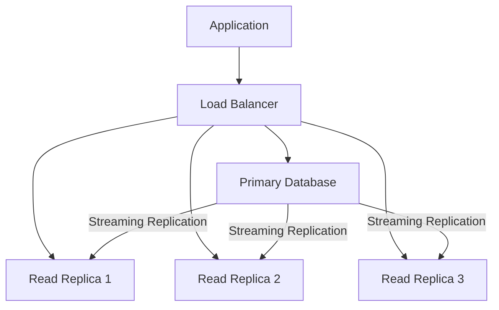
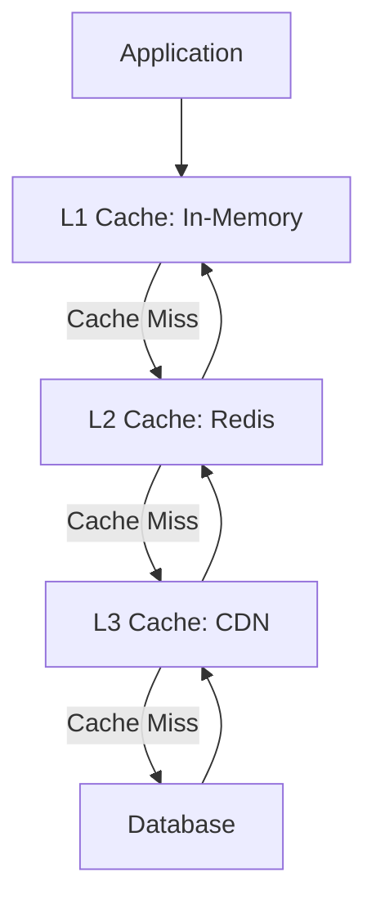

# Paya Scalability Architecture

## Table of Contents
1. [Horizontal Scaling Strategies](#horizontal-scaling-strategies)
2. [Load Balancing](#load-balancing)
3. [Database Scaling](#database-scaling)
4. [Caching Layers](#caching-layers)
5. [CDN Integration](#cdn-integration)
6. [Performance Optimization](#performance-optimization)

## Horizontal Scaling Strategies

### Application Scaling

#### Kubernetes Horizontal Pod Autoscaler

```yaml
apiVersion: autoscaling/v2
kind: HorizontalPodAutoscaler
metadata:
  name: backend-hpa
  namespace: paya
spec:
  scaleTargetRef:
    apiVersion: apps/v1
    kind: Deployment
    name: backend
  minReplicas: 3
  maxReplicas: 20
  metrics:
  - type: Resource
    resource:
      name: cpu
      target:
        type: Utilization
        averageUtilization: 70
  - type: Resource
    resource:
      name: memory
      target:
        type: Utilization
        averageUtilization: 80
  behavior:
    scaleDown:
      stabilizationWindowSeconds: 300
      policies:
      - type: Percent
        value: 10
        periodSeconds: 60
    scaleUp:
      stabilizationWindowSeconds: 60
      policies:
      - type: Percent
        value: 100
        periodSeconds: 30
      - type: Pods
        value: 4
        periodSeconds: 30
      selectPolicy: Max
```

#### Custom Metrics Scaling

```yaml
apiVersion: autoscaling/v2
kind: HorizontalPodAutoscaler
metadata:
  name: backend-hpa-custom
  namespace: paya
spec:
  scaleTargetRef:
    apiVersion: apps/v1
    kind: Deployment
    name: backend
  minReplicas: 3
  maxReplicas: 20
  metrics:
  - type: Pods
    pods:
      metric:
        name: active_connections
      target:
        type: AverageValue
        averageValue: "1000"
```

### Stateless Service Design

**Principles:**
- No local state storage
- Session data in Redis
- File storage in S3
- Database connection pooling

**Implementation:**
```typescript
// Stateless service example
@Injectable()
export class PaymentService {
  constructor(
    @InjectRedis() private redis: Redis,
    private paymentRepository: PaymentRepository,
  ) {}

  async createPayment(dto: CreatePaymentDto): Promise<Payment> {
    // No local state
    const payment = await this.paymentRepository.create(dto);
    
    // Cache in Redis
    await this.redis.setex(
      `payment:${payment.id}`,
      300,
      JSON.stringify(payment)
    );
    
    return payment;
  }
}
```

### Connection Pooling

**Database Connection Pool:**

```typescript
// TypeORM connection pool configuration
{
  type: 'postgres',
  host: process.env.DATABASE_HOST,
  port: parseInt(process.env.DATABASE_PORT),
  username: process.env.DATABASE_USER,
  password: process.env.DATABASE_PASSWORD,
  database: process.env.DATABASE_NAME,
  entities: [__dirname + '/**/*.entity{.ts,.js}'],
  synchronize: false,
  logging: false,
  poolSize: 20,
  extra: {
    max: 20,
    min: 5,
    idleTimeoutMillis: 30000,
    connectionTimeoutMillis: 2000,
  },
}
```

**Redis Connection Pool:**

```typescript
// Redis connection pool
const redis = new Redis({
  host: process.env.REDIS_HOST,
  port: parseInt(process.env.REDIS_PORT),
  maxRetriesPerRequest: 3,
  enableReadyCheck: true,
  enableOfflineQueue: true,
  retryStrategy: (times) => {
    const delay = Math.min(times * 50, 2000);
    return delay;
  },
});
```

## Load Balancing

### Application Load Balancer

#### Nginx Configuration

```nginx
upstream backend {
    least_conn;
    server backend-1:3000 weight=5;
    server backend-2:3000 weight=5;
    server backend-3:3000 weight=5;
    
    keepalive 32;
}

server {
    listen 443 ssl http2;
    server_name api.paya.io;

    ssl_certificate /etc/ssl/certs/paya.crt;
    ssl_certificate_key /etc/ssl/private/paya.key;

    location / {
        proxy_pass http://backend;
        proxy_http_version 1.1;
        proxy_set_header Upgrade $http_upgrade;
        proxy_set_header Connection 'upgrade';
        proxy_set_header Host $host;
        proxy_set_header X-Real-IP $remote_addr;
        proxy_set_header X-Forwarded-For $proxy_add_x_forwarded_for;
        proxy_set_header X-Forwarded-Proto $scheme;
        
        proxy_connect_timeout 5s;
        proxy_send_timeout 60s;
        proxy_read_timeout 60s;
        
        proxy_buffering on;
        proxy_buffer_size 4k;
        proxy_buffers 8 4k;
        proxy_busy_buffers_size 8k;
    }
}
```

#### Load Balancing Algorithms

| Algorithm | Use Case | Pros | Cons |
|-----------|----------|------|------|
| Round Robin | General purpose | Simple, even distribution | Doesn't consider server load |
| Least Connections | Long-running requests | Balances based on load | Requires connection tracking |
| IP Hash | Session persistence | Same client to same server | Uneven distribution |
| Weighted Round Robin | Different server capacities | Handles heterogeneous servers | Manual weight configuration |

### Database Load Balancing

#### Read Replicas

```typescript
// Read replica configuration
const readReplicaDataSource = new DataSource({
  type: 'postgres',
  host: process.env.DATABASE_READ_REPLICA_HOST,
  port: parseInt(process.env.DATABASE_PORT),
  username: process.env.DATABASE_USER,
  password: process.env.DATABASE_PASSWORD,
  database: process.env.DATABASE_NAME,
  entities: [__dirname + '/**/*.entity{.ts,.js}'],
  synchronize: false,
  logging: false,
});

@Injectable()
export class PaymentRepository {
  constructor(
    @InjectRepository(Payment) private writeRepo: Repository<Payment>,
  ) {}

  async create(payment: Payment): Promise<Payment> {
    // Write to primary
    return this.writeRepo.save(payment);
  }

  async findById(id: string): Promise<Payment> {
    // Read from replica
    return readReplicaDataSource.getRepository(Payment).findOne({ where: { id } });
  }
}
```

#### Proxy Connection Routing

```typescript
// ProxySQL configuration
@Injectable()
export class DatabaseProxyService {
  async routeQuery(query: string, isWrite: boolean): Promise<any> {
    const connection = isWrite 
      ? this.primaryConnection 
      : this.selectReadReplica();
    
    return connection.query(query);
  }

  private selectReadReplica(): Connection {
    const replicas = this.readReplicas;
    const load = replicas.map(r => this.getLoad(r));
    const minLoadIndex = load.indexOf(Math.min(...load));
    return replicas[minLoadIndex];
  }
}
```

## Database Scaling

### Read Replicas

**Architecture:**



**Configuration:**

```sql
-- Primary configuration
ALTER SYSTEM SET wal_level = replica;
ALTER SYSTEM SET max_wal_senders = 10;
ALTER SYSTEM SET wal_keep_size = '1GB';
ALTER SYSTEM SET synchronous_commit = on;

-- Replica configuration
ALTER SYSTEM SET hot_standby = on;
ALTER SYSTEM SET max_standby_streaming_delay = 30s;
```

### Database Sharding

**Sharding Strategy:**

```typescript
@Injectable()
export class ShardingService {
  private shards: Map<string, DataSource> = new Map();

  constructor() {
    this.initializeShards();
  }

  private initializeShards(): void {
    const shardConfigs = [
      { name: 'shard1', host: 'db-shard-1' },
      { name: 'shard2', host: 'db-shard-2' },
      { name: 'shard3', host: 'db-shard-3' },
    ];

    for (const config of shardConfigs) {
      const dataSource = new DataSource({
        type: 'postgres',
        host: config.host,
        port: 5432,
        username: process.env.DATABASE_USER,
        password: process.env.DATABASE_PASSWORD,
        database: config.name,
        entities: [Payment],
        synchronize: false,
      });
      
      this.shards.set(config.name, dataSource);
    }
  }

  getShard(merchantId: string): DataSource {
    const shardIndex = this.hashMerchantId(merchantId) % this.shards.size;
    const shardNames = Array.from(this.shards.keys());
    return this.shards.get(shardNames[shardIndex]);
  }

  private hashMerchantId(merchantId: string): number {
    let hash = 0;
    for (let i = 0; i < merchantId.length; i++) {
      hash = ((hash << 5) - hash) + merchantId.charCodeAt(i);
      hash |= 0;
    }
    return Math.abs(hash);
  }
}
```

### Partitioning

**Table Partitioning:**

```sql
-- Partition payments by date
CREATE TABLE payments (
    id UUID PRIMARY KEY,
    merchant_id UUID NOT NULL,
    amount DECIMAL(20,8) NOT NULL,
    created_at TIMESTAMP NOT NULL
) PARTITION BY RANGE (created_at);

-- Create partitions
CREATE TABLE payments_2024_q1 PARTITION OF payments
    FOR VALUES FROM ('2024-01-01') TO ('2024-04-01');

CREATE TABLE payments_2024_q2 PARTITION OF payments
    FOR VALUES FROM ('2024-04-01') TO ('2024-07-01');

CREATE TABLE payments_2024_q3 PARTITION OF payments
    FOR VALUES FROM ('2024-07-01') TO ('2024-10-01');

CREATE TABLE payments_2024_q4 PARTITION OF payments
    FOR VALUES FROM ('2024-10-01') TO ('2025-01-01');
```

**Partition Pruning:**

```typescript
// Query optimization with partition pruning
async getPaymentsByDateRange(startDate: Date, endDate: Date): Promise<Payment[]> {
  return this.paymentRepository
    .createQueryBuilder('payment')
    .where('payment.createdAt >= :startDate')
    .andWhere('payment.createdAt < :endDate')
    .setParameters({ startDate, endDate })
    .getMany();
  // PostgreSQL will only scan relevant partitions
}
```

## Caching Layers

### Multi-Level Caching

**Architecture:**



**Implementation:**

```typescript
@Injectable()
export class MultiLevelCacheService {
  private l1Cache = new Map<string, { data: any; expiry: number }>();
  private l1TTL = 1000; // 1 second
  private l2TTL = 300; // 5 minutes

  constructor(@InjectRedis() private redis: Redis) {}

  async get(key: string): Promise<any> {
    // L1 Cache
    const l1Item = this.l1Cache.get(key);
    if (l1Item && l1Item.expiry > Date.now()) {
      return l1Item.data;
    }

    // L2 Cache
    const l2Item = await this.redis.get(key);
    if (l2Item) {
      const data = JSON.parse(l2Item);
      this.l1Cache.set(key, { data, expiry: Date.now() + this.l1TTL });
      return data;
    }

    return null;
  }

  async set(key: string, value: any): Promise<void> {
    // L1 Cache
    this.l1Cache.set(key, { data: value, expiry: Date.now() + this.l1TTL });

    // L2 Cache
    await this.redis.setex(key, this.l2TTL, JSON.stringify(value));
  }

  async invalidate(key: string): Promise<void> {
    this.l1Cache.delete(key);
    await this.redis.del(key);
  }
}
```

### Cache Warming

**Strategy:**

```typescript
@Injectable()
export class CacheWarmupService {
  @Cron('0 */5 * * * *') // Every 5 minutes
  async warmPopularPayments(): Promise<void> {
    const popularPayments = await this.paymentRepository.find({
      where: { status: 'COMPLETED' },
      order: { createdAt: 'DESC' },
      take: 100,
    });

    for (const payment of popularPayments) {
      await this.cacheService.set(
        `payment:${payment.id}`,
        payment
      );
    }
  }

  @Cron('0 0 * * * *') // Every hour
  async warmPopularPlans(): Promise<void> {
    const popularPlans = await this.planRepository.find({
      where: { status: 'ACTIVE' },
      take: 50,
    });

    for (const plan of popularPlans) {
      await this.cacheService.set(
        `plan:${plan.id}`,
        plan
      );
    }
  }
}
```

### Cache Invalidation

**Event-Based Invalidation:**

```typescript
@Injectable()
export class CacheInvalidationService {
  constructor(
    private eventEmitter: EventEmitter2,
    private cacheService: CacheService,
  ) {
    this.setupInvalidationListeners();
  }

  private setupInvalidationListeners(): void {
    this.eventEmitter.on('payment.updated', async (payment) => {
      await this.cacheService.invalidate(`payment:${payment.id}`);
    });

    this.eventEmitter.on('subscription.updated', async (subscription) => {
      await this.cacheService.invalidate(`subscription:${subscription.id}`);
    });

    this.eventEmitter.on('plan.updated', async (plan) => {
      await this.cacheService.invalidate(`plan:${plan.id}`);
    });
  }
}
```

## CDN Integration

### Static Asset Delivery

**CloudFront Configuration:**

```typescript
// CDN service
@Injectable()
export class CdnService {
  private cloudFront = new AWS.CloudFront({
    accessKeyId: process.env.AWS_ACCESS_KEY_ID,
    secretAccessKey: process.env.AWS_SECRET_ACCESS_KEY,
    region: 'us-east-1',
  });

  async invalidatePaths(paths: string[]): Promise<void> {
    const invalidation = await this.cloudFront.createInvalidation({
      DistributionId: process.env.CLOUDFRONT_DISTRIBUTION_ID,
      InvalidationBatch: {
        CallerReference: Date.now().toString(),
        Paths: {
          Quantity: paths.length,
          Items: paths,
        },
      },
    }).promise();

    console.log('Invalidation created:', invalidation.Invalidation.Id);
  }

  async getSignedUrl(key: string): Promise<string> {
    const signer = new AWS.CloudFront.Signer(
      process.env.CLOUDFRONT_KEY_PAIR_ID,
      process.env.CLOUDFRONT_PRIVATE_KEY
    );

    return signer.getSignedUrl({
      url: `https://${process.env.CLOUDFRONT_DOMAIN}/${key}`,
      expires: new Date(Date.now() + 3600000), // 1 hour
    });
  }
}
```

### API Caching

**CDN for API Responses:**

```typescript
// Cache-Control headers
@Injectable()
export class CacheControlInterceptor implements NestInterceptor {
  intercept(context: ExecutionContext, next: CallHandler): Observable<any> {
    const request = context.switchToHttp().getRequest();
    const response = context.switchToHttp().getResponse();

    // Cache GET requests for public data
    if (request.method === 'GET' && this.isCacheable(request)) {
      response.setHeader('Cache-Control', 'public, max-age=300');
      response.setHeader('CDN-Cache-Control', 'public, max-age=3600');
    }

    return next.handle();
  }

  private isCacheable(request: Request): boolean {
    const cacheablePaths = ['/plans', '/public'];
    return cacheablePaths.some(path => request.path.startsWith(path));
  }
}
```

### Edge Computing

**CloudFront Functions:**

```javascript
// CloudFront function for request routing
function handler(event) {
  const request = event.request;
  const uri = request.uri;

  // Route API requests to backend
  if (uri.startsWith('/api/')) {
    request.origin = {
      custom: {
        domainName: 'api.paya.io',
        port: 443,
        protocol: 'https',
        path: '',
        sslProtocols: ['TLSv1.2'],
        readTimeout: 30,
        keepaliveTimeout: 5,
      },
    };
  }

  return request;
}
```

## Performance Optimization

### Database Optimization

**Indexing Strategy:**

```sql
-- Composite indexes for common queries
CREATE INDEX idx_payments_merchant_status 
ON payments(merchant_id, status);

CREATE INDEX idx_payments_created_status 
ON payments(created_at DESC, status);

CREATE INDEX idx_subscriptions_next_payment 
ON subscriptions(next_payment_at) 
WHERE status = 'ACTIVE';

-- Partial indexes for filtering
CREATE INDEX idx_active_subscriptions 
ON subscriptions(customer_id) 
WHERE status = 'ACTIVE';
```

**Query Optimization:**

```typescript
// Optimized query with specific fields
async getPaymentSummary(paymentId: string): Promise<PaymentSummary> {
  return this.paymentRepository
    .createQueryBuilder('payment')
    .select([
      'payment.id',
      'payment.amount',
      'payment.currency',
      'payment.status',
    ])
    .where('payment.id = :paymentId', { paymentId })
    .getOne();
}

// Batch operations
async updatePaymentsStatus(paymentIds: string[], status: string): Promise<void> {
  await this.paymentRepository
    .createQueryBuilder()
    .update(Payment)
    .set({ status })
    .where('id IN (:...paymentIds)', { paymentIds })
    .execute();
}
```

### Application Optimization

**Async Processing:**

```typescript
// Async payment processing
@Injectable()
export class AsyncPaymentService {
  constructor(private paymentQueue: Queue) {}

  async createPaymentAsync(dto: CreatePaymentDto): Promise<string> {
    const paymentId = uuidv4();

    await this.paymentQueue.add('create-payment', {
      paymentId,
      ...dto,
    });

    return paymentId;
  }

  @Processor('create-payment')
  async processPayment(job: Job): Promise<void> {
    const { paymentId, ...paymentData } = job.data;

    const payment = await this.paymentRepository.create({
      id: paymentId,
      ...paymentData,
    });

    await this.processStellarTransaction(payment);
  }
}
```

**Batch Processing:**

```typescript
// Batch webhook delivery
@Injectable()
export class BatchWebhookService {
  async deliverWebhooksBatch(events: WebhookEvent[]): Promise<void> {
    const batches = this.chunkArray(events, 100);

    for (const batch of batches) {
      await Promise.all(
        batch.map(event => this.deliverWebhook(event))
      );
    }
  }

  private chunkArray<T>(array: T[], size: number): T[][] {
    const chunks = [];
    for (let i = 0; i < array.length; i += size) {
      chunks.push(array.slice(i, i + size));
    }
    return chunks;
  }
}
```

### Memory Optimization

**Object Pooling:**

```typescript
// Object pool for heavy objects
@Injectable()
export class ObjectPool<T> {
  private pool: T[] = [];
  private factory: () => T;
  private maxSize: number;

  constructor(factory: () => T, maxSize: number = 100) {
    this.factory = factory;
    this.maxSize = maxSize;
  }

  acquire(): T {
    if (this.pool.length > 0) {
      return this.pool.pop();
    }
    return this.factory();
  }

  release(obj: T): void {
    if (this.pool.length < this.maxSize) {
      this.pool.push(obj);
    }
  }
}
```

**Stream Processing:**

```typescript
// Stream large datasets
async streamPayments(handler: (payment: Payment) => Promise<void>): Promise<void> {
  const queryRunner = this.connection.createQueryRunner();

  try {
    await queryRunner.connect();
    const cursor = await queryRunner.manager.query(
      'SELECT * FROM payments WHERE status = $1',
      ['COMPLETED']
    );

    for await (const row of cursor) {
      await handler(row);
    }
  } finally {
    await queryRunner.release();
  }
}
```

### Network Optimization

**Compression:**

```typescript
// Enable compression in NestJS
async function bootstrap() {
  const app = await NestFactory.create(AppModule);
  
  app.use(compression({
    filter: (req, res) => {
      if (req.headers['x-no-compression']) {
        return false;
      }
      return compression.filter(req, res);
    },
    threshold: 1024, // Only compress responses larger than 1KB
  }));
  
  await app.listen(3000);
}
```

**HTTP/2:**

```typescript
// Enable HTTP/2
async function bootstrap() {
  const app = await NestFactory.create(AppModule);
  
  await app.init();
  
  const server = http2.createSecureServer({
    key: fs.readFileSync('server.key()),
    cert: fs.readFileSync('server.crt'),
  }, app.getHttpAdapter().getInstance());
  
  server.listen(3000);
}
```

## Performance Monitoring

### Performance Metrics

```typescript
// Performance tracking
@Injectable()
export class PerformanceTracker {
  private metrics = {
    requestDuration: new Histogram({ name: 'request_duration_ms' }),
    dbQueryDuration: new Histogram({ name: 'db_query_duration_ms' }),
    cacheHitRate: new Gauge({ name: 'cache_hit_rate' }),
  };

  trackRequestTime(duration: number): void {
    this.metrics.requestDuration.observe(duration);
  }

  trackDbQueryTime(duration: number): void {
    this.metrics.dbQueryDuration.observe(duration);
  }

  updateCacheHitRate(rate: number): void {
    this.metrics.cacheHitRate.set(rate);
  }
}
```

### Performance Profiling

```typescript
// Profiling middleware
@Injectable()
export class ProfilingMiddleware implements NestMiddleware {
  use(req: Request, res: Response, next: NextFunction): void {
    const start = Date.now();

    res.on('finish', () => {
      const duration = Date.now() - start;
      console.log(`${req.method} ${req.path} - ${duration}ms`);
    });

    next();
  }
}
```

## Support

For scalability questions, contact:
- **Performance Team**: performance@paya.io
- **Infrastructure Team**: infra@paya.io
- **Slack**: #paya-scalability
