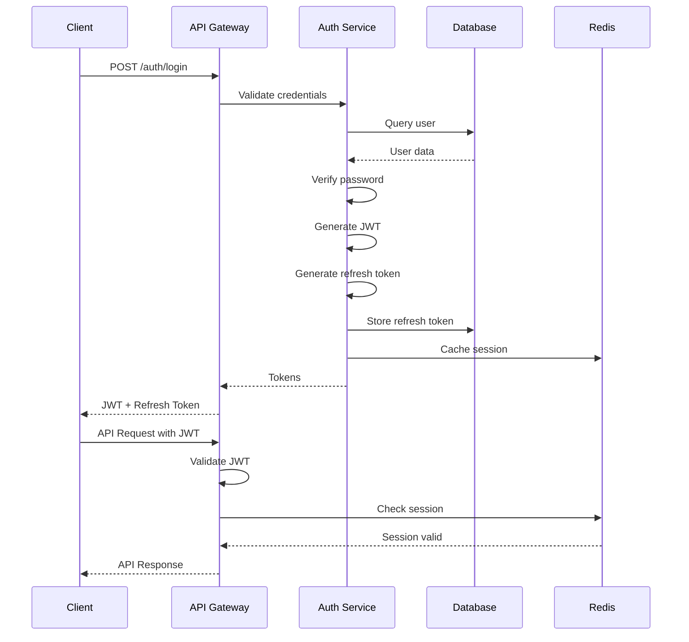
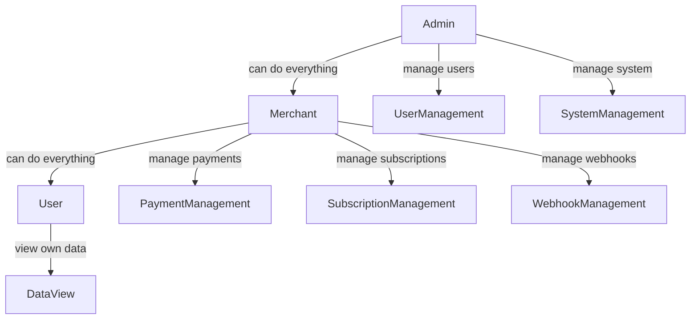
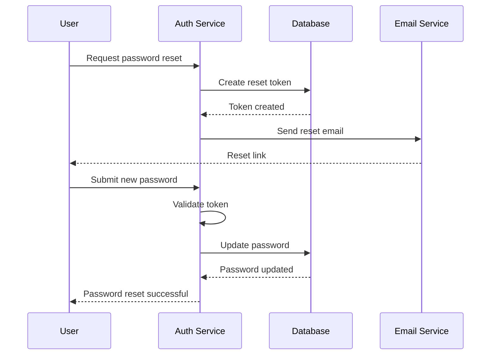
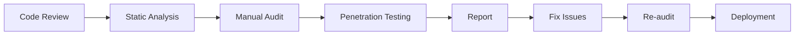
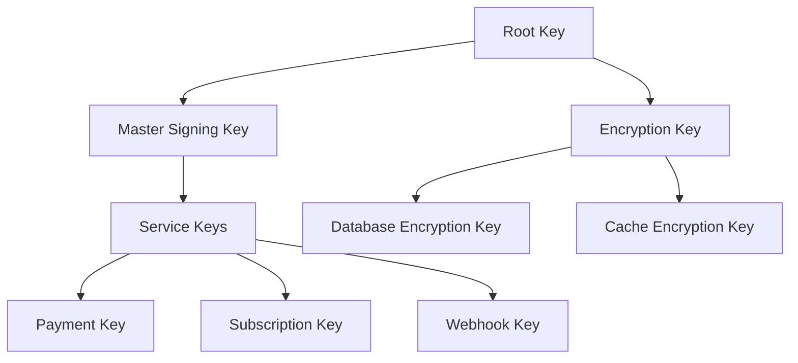

# Paya Security Architecture

## Table of Contents
1. [Authentication and Authorization](#authentication-and-authorization)
2. [API Security](#api-security)
3. [Smart Contract Security](#smart-contract-security)
4. [Key Management](#key-management)
5. [Network Security](#network-security)
6. [Compliance](#compliance)

## Authentication and Authorization

### Authentication Flow



### JWT Implementation

#### Token Structure

**Access Token:**
```typescript
{
  sub: "user_id",
  email: "user@example.com",
  role: "MERCHANT",
  iat: 1234567890,
  exp: 1234571490,
  iss: "paya.io"
}
```

**Refresh Token:**
```typescript
{
  sub: "user_id",
  tokenId: "token_id",
  iat: 1234567890,
  exp: 1234654290,
  iss: "paya.io"
}
```

#### Token Validation

```typescript
@Injectable()
export class JwtAuthGuard implements CanActivate {
  constructor(private jwtService: JwtService) {}

  canActivate(context: ExecutionContext): boolean {
    const request = context.switchToHttp().getRequest();
    const token = this.extractTokenFromHeader(request);

    if (!token) {
      throw new UnauthorizedException();
    }

    try {
      const payload = this.jwtService.verify(token);
      request.user = payload;
      return true;
    } catch {
      throw new UnauthorizedException();
    }
  }

  private extractTokenFromHeader(request: Request): string | undefined {
    const [type, token] = request.headers.authorization?.split(' ') ?? [];
    return type === 'Bearer' ? token : undefined;
  }
}
```

### Role-Based Access Control (RBAC)

#### Role Hierarchy



#### Role Implementation

```typescript
export enum Role {
  USER = 'USER',
  MERCHANT = 'MERCHANT',
  ADMIN = 'ADMIN',
}

@Injectable()
export class RolesGuard implements CanActivate {
  constructor(private reflector: Reflector) {}

  canActivate(context: ExecutionContext): boolean {
    const requiredRoles = this.reflector.getAllAndOverride<Role[]>(ROLES_KEY, [
      context.getHandler(),
      context.getClass(),
    ]);

    if (!requiredRoles) {
      return true;
    }

    const { user } = context.switchToHttp().getRequest();
    return requiredRoles.some((role) => user.role === role);
  }
}
```

#### Role Decorator

```typescript
export const ROLES_KEY = 'roles';
export const Roles = (...roles: Role[]) => SetMetadata(ROLES_KEY, roles);

// Usage
@Post('payments')
@Roles(Role.MERCHANT)
async createPayment(@Body() dto: CreatePaymentDto) {
  // Only merchants can create payments
}
```

### Password Security

#### Password Hashing

```typescript
@Injectable()
export class AuthService {
  constructor(
    private usersService: UsersService,
    private jwtService: JwtService,
  ) {}

  async register(dto: RegisterDto) {
    const hashedPassword = await bcrypt.hash(dto.password, 12);
    const user = await this.usersService.create({
      ...dto,
      password: hashedPassword,
    });
    return this.generateTokens(user);
  }
}
```

#### Password Requirements

- Minimum length: 12 characters
- Must include: uppercase, lowercase, number, special character
- Cannot contain: username, email
- Password history: last 5 passwords not allowed

#### Password Reset Flow



### Session Management

#### Session Storage

```typescript
@Injectable()
export class SessionService {
  constructor(@InjectRedis() private redis: Redis) {}

  async createSession(userId: string, sessionData: SessionData) {
    const sessionId = uuidv4();
    const key = `session:${userId}:${sessionId}`;
    
    await this.redis.setex(key, 3600, JSON.stringify(sessionData));
    
    return sessionId;
  }

  async getSession(userId: string, sessionId: string) {
    const key = `session:${userId}:${sessionId}`;
    const session = await this.redis.get(key);
    
    if (!session) {
      throw new UnauthorizedException('Session expired');
    }
    
    return JSON.parse(session);
  }

  async invalidateSession(userId: string, sessionId: string) {
    const key = `session:${userId}:${sessionId}`;
    await this.redis.del(key);
  }

  async invalidateAllSessions(userId: string) {
    const pattern = `session:${userId}:*`;
    const keys = await this.redis.keys(pattern);
    
    if (keys.length > 0) {
      await this.redis.del(...keys);
    }
  }
}
```

## API Security

### Rate Limiting

#### Rate Limiting Strategy

```typescript
@Injectable()
export class RateLimitGuard implements CanActivate {
  constructor(@InjectRedis() private redis: Redis) {}

  async canActivate(context: ExecutionContext): boolean {
    const request = context.switchToHttp().getRequest();
    const userId = request.user?.id || request.ip;
    const endpoint = request.route.path;
    
    const key = `ratelimit:${userId}:${endpoint}`;
    const current = await this.redis.incr(key);
    
    if (current === 1) {
      await this.redis.expire(key, 60); // 1 minute window
    }
    
    const limits = this.getLimits(endpoint);
    
    if (current > limits.max) {
      throw new ThrottlerException('Rate limit exceeded');
    }
    
    return true;
  }

  private getLimits(endpoint: string): RateLimitConfig {
    const limits = {
      '/api/v1/payments': { max: 100 },
      '/api/v1/subscriptions': { max: 50 },
      '/api/v1/auth/login': { max: 10 },
      '/api/v1/auth/register': { max: 5 },
    };
    
    return limits[endpoint] || { max: 1000 };
  }
}
```

#### Rate Limiting Tiers

| Tier | Requests/Minute | Requests/Hour | Requests/Day |
|------|-----------------|---------------|--------------|
| Free | 60 | 1,000 | 10,000 |
| Pro | 300 | 5,000 | 50,000 |
| Enterprise | 1,000 | 20,000 | 200,000 |

### Request Signing

#### HMAC Signature

```typescript
@Injectable()
export class SignatureService {
  async signRequest(
    apiKey: string,
    apiSecret: string,
    method: string,
    path: string,
    body: any,
    timestamp: number,
  ): Promise<string> {
    const payload = `${method}\n${path}\n${timestamp}\n${JSON.stringify(body)}`;
    
    const signature = crypto
      .createHmac('sha256', apiSecret)
      .update(payload)
      .digest('hex');
    
    return signature;
  }

  async verifySignature(
    apiKey: string,
    apiSecret: string,
    method: string,
    path: string,
    body: any,
    timestamp: number,
    signature: string,
  ): Promise<boolean> {
    // Check timestamp (prevent replay attacks)
    const now = Math.floor(Date.now() / 1000);
    if (Math.abs(now - timestamp) > 300) {
      return false;
    }

    const expectedSignature = await this.signRequest(
      apiKey,
      apiSecret,
      method,
      path,
      body,
      timestamp,
    );

    return signature === expectedSignature;
  }
}
```

#### Signature Headers

```
X-Paya-Api-Key: your_api_key
X-Paya-Timestamp: 1234567890
X-Paya-Signature: abc123...
```

### API Key Management

#### API Key Generation

```typescript
@Injectable()
export class ApiKeyService {
  async generateApiKey(userId: string): Promise<ApiKey> {
    const apiKey = this.generateSecureKey();
    const apiSecret = this.generateSecureKey();
    
    const hashedSecret = await bcrypt.hash(apiSecret, 12);
    
    const apiKeyRecord = await this.apiKeyRepository.create({
      userId,
      apiKey,
      apiSecret: hashedSecret,
      name: `API Key ${Date.now()}`,
      status: 'ACTIVE',
    });
    
    return {
      apiKey,
      apiSecret,
      ...apiKeyRecord,
    };
  }

  private generateSecureKey(): string {
    return crypto.randomBytes(32).toString('hex');
  }
}
```

#### API Key Scopes

| Scope | Description |
|-------|-------------|
| `payments:create` | Create payments |
| `payments:read` | Read payments |
| `payments:update` | Update payments |
| `subscriptions:create` | Create subscriptions |
| `subscriptions:read` | Read subscriptions |
| `webhooks:manage` | Manage webhooks |

### Input Validation

#### DTO Validation

```typescript
export class CreatePaymentDto {
  @IsNumber()
  @Min(0.01)
  @Max(1000000)
  amount: number;

  @IsString()
  @Length(3, 10)
  @Matches(/^[A-Z]{3}$/)
  currency: string;

  @IsEmail()
  customerEmail: string;

  @IsString()
  @MaxLength(500)
  description?: string;

  @IsOptional()
  @ValidateNested()
  metadata?: Record<string, any>;
}
```

#### Sanitization

```typescript
@Injectable()
export class SanitizationPipe implements PipeTransform {
  transform(value: any) {
    if (typeof value === 'string') {
      // Remove potentially dangerous characters
      return value.replace(/[<>]/g, '');
    }
    
    if (typeof value === 'object') {
      return this.sanitizeObject(value);
    }
    
    return value;
  }

  private sanitizeObject(obj: any): any {
    const sanitized = {};
    
    for (const key in obj) {
      if (typeof obj[key] === 'string') {
        sanitized[key] = obj[key].replace(/[<>]/g, '');
      } else if (typeof obj[key] === 'object') {
        sanitized[key] = this.sanitizeObject(obj[key]);
      } else {
        sanitized[key] = obj[key];
      }
    }
    
    return sanitized;
  }
}
```

## Smart Contract Security

### Contract Security Patterns

#### Access Control

```rust
// Soroban contract with access control
pub struct Contract {
    admin: Address,
}

#[contractimpl]
impl Contract {
    pub fn initialize(env: &Env, admin: Address) {
        env.storage().instance().set(&Symbol::new(&env, "admin"), &admin);
    }

    pub fn only_admin(env: &Env) {
        let admin: Address = env.storage().instance()
            .get(&Symbol::new(&env, "admin"))
            .unwrap();
        
        let caller = env.invoker();
        
        assert_eq!(caller, admin, "Unauthorized");
    }
}
```

#### Reentrancy Protection

```rust
#[contractimpl]
impl Contract {
    pub fn withdraw(env: &Env, amount: i128) {
        // Check effects before interactions
        let balance: i128 = env.storage().instance()
            .get(&Symbol::new(&env, "balance"))
            .unwrap();
        
        assert!(balance >= amount, "Insufficient balance");
        
        // Update balance before transfer
        env.storage().instance().set(
            &Symbol::new(&env, "balance"),
            &(balance - amount)
        );
        
        // Transfer after state update
        // ... transfer logic
    }
}
```

#### Input Validation

```rust
#[contractimpl]
impl Contract {
    pub fn create_payment(env: &Env, amount: i128, recipient: Address) {
        // Validate amount
        assert!(amount > 0, "Amount must be positive");
        assert!(amount <= MAX_AMOUNT, "Amount exceeds maximum");
        
        // Validate recipient
        assert!(!recipient.is_zero(), "Invalid recipient");
        
        // ... payment logic
    }
}
```

### Contract Auditing

#### Audit Checklist

- [ ] Access control implementation
- [ ] Reentrancy protection
- [ ] Input validation
- [ ] Integer overflow/underflow protection
- [ ] Emergency stop mechanism
- [ ] Upgradeability mechanism
- [ ] Gas optimization
- [ ] Event logging

#### Audit Process



### Contract Upgradeability

#### Proxy Pattern

```rust
// Proxy contract
pub struct Proxy {
    implementation: Address,
}

#[contractimpl]
impl Proxy {
    pub fn upgrade(env: &Env, new_implementation: Address) {
        // Only admin can upgrade
        Self::only_admin(env);
        
        // Update implementation
        env.storage().instance().set(
            &Symbol::new(&env, "implementation"),
            &new_implementation
        );
    }

    pub fn delegate_call(env: &Env, fn_name: Symbol, args: Vec<Val>) {
        let implementation: Address = env.storage().instance()
            .get(&Symbol::new(&env, "implementation"))
            .unwrap();
        
        // Delegate call to implementation
        env.invoke_contract(
            &implementation,
            &fn_name,
            args
        );
    }
}
```

## Key Management

### Key Hierarchy



### Key Storage

#### Hardware Security Module (HSM)

```typescript
// HSM integration for key storage
@Injectable()
export class HsmService {
  async generateKey(): Promise<KeyPair> {
    // Generate key in HSM
    const keyPair = await this.hsm.generateKey({
      algorithm: 'RSA',
      keySize: 2048,
    });
    
    return keyPair;
  }

  async signWithKey(keyId: string, data: Buffer): Promise<Buffer> {
    // Sign using HSM
    const signature = await this.hsm.sign(keyId, data);
    return signature;
  }

  async encryptWithKey(keyId: string, data: Buffer): Promise<Buffer> {
    // Encrypt using HSM
    const encrypted = await this.hsm.encrypt(keyId, data);
    return encrypted;
  }
}
```

#### Key Rotation

```typescript
@Injectable()
export class KeyRotationService {
  @Cron('0 0 1 * *') // Monthly rotation
  async rotateKeys() {
    // Generate new keys
    const newKeys = await this.generateNewKeys();
    
    // Update services to use new keys
    await this.updateServiceKeys(newKeys);
    
    // Archive old keys
    await this.archiveOldKeys();
    
    // Notify monitoring
    await this.notifyKeyRotation();
  }

  private async generateNewKeys(): Promise<KeyPair[]> {
    return [
      await this.hsmService.generateKey(),
      await this.hsmService.generateKey(),
    ];
  }
}
```

### Key Access Control

#### Principle of Least Privilege

```typescript
@Injectable()
export class KeyAccessService {
  async getKey(keyId: string, userId: string): Promise<Key> {
    // Check user permissions
    const hasAccess = await this.checkPermissions(userId, keyId);
    
    if (!hasAccess) {
      throw new ForbiddenException('No access to key');
    }
    
    // Log key access
    await this.logKeyAccess(userId, keyId);
    
    // Retrieve key from secure storage
    return this.hsmService.getKey(keyId);
  }

  private async checkPermissions(userId: string, keyId: string): Promise<boolean> {
    const user = await this.usersService.findById(userId);
    const key = await this.keyRepository.findById(keyId);
    
    return this.userHasAccessToKey(user, key);
  }
}
```

## Network Security

### TLS Configuration

#### TLS 1.3 Configuration

```nginx
server {
    listen 443 ssl http2;
    server_name api.paya.io;

    ssl_certificate /etc/ssl/certs/paya.crt;
    ssl_certificate_key /etc/ssl/private/paya.key;

    ssl_protocols TLSv1.3;
    ssl_ciphers ECDHE-ECDSA-AES256-GCM-SHA384:ECDHE-RSA-AES256-GCM-SHA384;
    ssl_prefer_server_ciphers off;

    ssl_session_cache shared:SSL:10m;
    ssl_session_timeout 10m;

    ssl_stapling on;
    ssl_stapling_verify on;
    ssl_trusted_certificate /etc/ssl/certs/ca-bundle.crt;
}
```

#### Certificate Management

```typescript
@Injectable()
export class CertificateService {
  async renewCertificate(): Promise<void> {
    // Check certificate expiration
    const cert = await this.getCurrentCertificate();
    const daysUntilExpiry = this.getDaysUntilExpiry(cert);
    
    if (daysUntilExpiry < 30) {
      // Renew certificate
      await this.acmeService.renewCertificate();
      
      // Update load balancer
      await this.updateLoadBalancer();
      
      // Notify team
      await this.notifyCertificateRenewed();
    }
  }
}
```

### Firewall Rules

#### Inbound Rules

| Protocol | Port | Source | Purpose |
|----------|------|--------|---------|
| HTTPS | 443 | 0.0.0.0/0 | API access |
| SSH | 22 | VPN subnet | Admin access |
| PostgreSQL | 5432 | Application subnet | Database access |
| Redis | 6379 | Application subnet | Cache access |

#### Outbound Rules

| Protocol | Port | Destination | Purpose |
|----------|------|-------------|---------|
| HTTPS | 443 | Stellar Horizon | Blockchain access |
| HTTPS | 443 | Email provider | Email delivery |
| HTTPS | 443 | Webhook endpoints | Webhook delivery |

### DDoS Protection

#### Rate Limiting

```typescript
@Injectable()
export class DdosProtectionService {
  private readonly ipRequests = new Map<string, number>();
  private readonly blockedIps = new Set<string>();

  async checkRequest(ip: string): Promise<boolean> {
    // Check if IP is blocked
    if (this.blockedIps.has(ip)) {
      throw new TooManyRequestsException('IP blocked');
    }

    // Check request rate
    const requests = this.ipRequests.get(ip) || 0;
    
    if (requests > 1000) {
      this.blockedIps.add(ip);
      throw new TooManyRequestsException('IP blocked due to DDoS');
    }

    this.ipRequests.set(ip, requests + 1);
    
    // Reset counter after 1 minute
    setTimeout(() => {
      this.ipRequests.set(ip, 0);
    }, 60000);

    return true;
  }
}
```

#### Cloudflare Integration

```typescript
@Injectable()
export class CloudflareService {
  async enableUnderAttackMode(): Promise<void> {
    await this.cloudflareAPI.updateSecurityLevel('under_attack');
  }

  async blockIp(ip: string): Promise<void> {
    await this.cloudflareAPI.createFirewallRule({
      mode: 'block',
      configuration: {
        target: 'ip',
        value: ip,
      },
    });
  }

  async enableChallenge(): Promise<void> {
    await this.cloudflareAPI.updateSecurityLevel('high');
  }
}
```

## Compliance

### PCI-DSS Compliance

#### Requirements Met

- **Requirement 1**: Install and maintain network security controls
  - Firewall configuration
  - Secure network architecture
  
- **Requirement 2**: Protect cardholder data
  - Encryption at rest
  - Encryption in transit
  
- **Requirement 3**: Maintain a vulnerability management program
  - Regular security updates
  - Vulnerability scanning
  
- **Requirement 4**: Implement strong access control measures
  - Role-based access control
  - Multi-factor authentication
  
- **Requirement 5**: Regularly monitor and test networks
  - Logging system
  - Intrusion detection
  
- **Requirement 6**: Maintain an information security policy
  - Security policies
  - Incident response plan

### GDPR Compliance

#### Data Protection Measures

```typescript
@Injectable()
export class GdprService {
  async exportUserData(userId: string): Promise<UserDataExport> {
    // Collect all user data
    const userData = await this.collectUserData(userId);
    
    // Encrypt data for transfer
    const encrypted = await this.encryptData(userData);
    
    return {
      data: encrypted,
      format: 'JSON',
      encryption: 'AES-256',
    };
  }

  async deleteUserData(userId: string): Promise<void> {
    // Delete user account
    await this.usersService.delete(userId);
    
    // Anonymize payments
    await this.anonymizePayments(userId);
    
    // Delete logs
    await this.deleteLogs(userId);
    
    // Confirm deletion
    await this.sendDeletionConfirmation(userId);
  }

  async anonymizeData(data: any): Promise<any> {
    // Remove PII
    const anonymized = {
      ...data,
      email: this.anonymizeEmail(data.email),
      name: this.anonymizeName(data.name),
    };
    
    return anonymized;
  }
}
```

### SOC 2 Compliance

#### Security Controls

- **Access Control**: Role-based access, MFA
- **Incident Response**: Documented procedures
- **Change Management**: Controlled deployment process
- **Monitoring**: Comprehensive logging and alerting
- **Encryption**: Data encryption at rest and in transit
- **Backup**: Regular backups with retention policies

### Audit Logging

#### Security Event Logging

```typescript
@Injectable()
export class AuditLogService {
  async logSecurityEvent(event: SecurityEvent): Promise<void> {
    await this.auditLogRepository.create({
      eventType: event.type,
      userId: event.userId,
      ipAddress: event.ipAddress,
      userAgent: event.userAgent,
      timestamp: new Date(),
      details: event.details,
    });

    // Send to SIEM
    await this.siemService.sendEvent(event);
  }

  async getAuditLogs(filters: AuditLogFilters): Promise<AuditLog[]> {
    return this.auditLogRepository.find({
      where: filters,
      order: { timestamp: 'DESC' },
      take: 100,
    });
  }
}
```

#### Event Types

| Event Type | Description | Severity |
|------------|-------------|----------|
| `LOGIN_SUCCESS` | Successful login | INFO |
| `LOGIN_FAILURE` | Failed login attempt | WARNING |
| `PASSWORD_RESET` | Password reset initiated | INFO |
| `API_KEY_CREATED` | API key created | INFO |
| `API_KEY_DELETED` | API key deleted | WARNING |
| `PAYMENT_CREATED` | Payment created | INFO |
| `PAYMENT_FAILED` | Payment failed | WARNING |
| `UNAUTHORIZED_ACCESS` | Unauthorized access attempt | CRITICAL |
| `DATA_EXPORT` | Data export initiated | INFO |
| `DATA_DELETION` | Data deletion initiated | WARNING |

## Support

For security questions, contact:
- **Security Team**: security@paya.io
- **CTO**: cto@paya.io
- **Slack**: #paya-security
