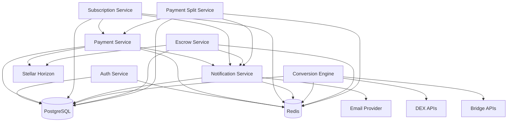

# Paya Service Architecture

## Table of Contents
1. [Service Overview](#service-overview)
2. [Auth Service](#auth-service)
3. [Payment Service](#payment-service)
4. [Subscription Service](#subscription-service)
5. [Notification Service](#notification-service)
6. [Conversion Engine](#conversion-engine)
7. [Escrow Service](#escrow-service)
8. [Payment Split Service](#payment-split-service)
9. [Service Communication Patterns](#service-communication-patterns)
10. [Failure Modes and Recovery](#failure-modes-and-recovery)

## Service Overview

### Service List

| Service | Responsibility | Tech Stack | Scaling |
|---------|---------------|------------|---------|
| Auth Service | Authentication & Authorization | NestJS, JWT, PostgreSQL | Horizontal |
| Payment Service | Payment processing | NestJS, Stellar SDK, Redis | Horizontal |
| Subscription Service | Recurring billing | NestJS, Bull, PostgreSQL | Horizontal |
| Notification Service | Webhooks & Email | NestJS, Bull, Redis | Horizontal |
| Conversion Engine | Currency conversion | NestJS, DEX APIs, Redis | Horizontal |
| Escrow Service | Escrow management | NestJS, Stellar SDK, PostgreSQL | Horizontal |
| Payment Split Service | Multi-recipient payments | NestJS, Stellar SDK, PostgreSQL | Horizontal |

### Service Boundaries

Each service has clear boundaries:
- **Owns its data** (specific database tables)
- **Exposes APIs** (REST or message queue)
- **Communicates asynchronously** via message queues
- **Independent deployment** capability

## Auth Service

### Responsibilities

- User registration and authentication
- JWT token generation and validation
- Password reset functionality
- Role-based access control (RBAC)
- Session management
- API key management

### Data Ownership

**Tables:**
- `users` - User accounts
- `refresh_tokens` - JWT refresh tokens
- `password_reset_tokens` - Password reset tokens

### Communication Patterns

**Synchronous:**
- REST API for authentication requests
- JWT validation via middleware

**Asynchronous:**
- Email notifications (password reset)
- Token cleanup jobs

### Dependencies

- PostgreSQL (user data)
- Redis (session storage)
- Email Service (notifications)

### Scaling Characteristics

**Stateless Design:**
- JWT tokens are self-contained
- No session affinity required
- Can scale horizontally

**Read-Heavy:**
- Frequent token validations
- Cache user data in Redis

### Failure Modes

**Database Down:**
- Cannot authenticate users
- Graceful degradation: Use cached tokens
- Recovery: Database failover

**Redis Down:**
- Session management fails
- Fallback to database
- Recovery: Redis failover

### API Endpoints

```
POST /auth/register
POST /auth/login
POST /auth/logout
POST /auth/refresh
POST /auth/forgot-password
POST /auth/reset-password
POST /auth/change-password
GET /auth/me
```

## Payment Service

### Responsibilities

- Payment creation and management
- Stellar transaction submission
- Payment status tracking
- Payment confirmation handling
- Refund processing
- Payment history

### Data Ownership

**Tables:**
- `payments` - Payment records
- `payment_transactions` - Stellar transactions

### Communication Patterns

**Synchronous:**
- REST API for payment operations
- Real-time payment status queries

**Asynchronous:**
- Payment confirmation events
- Webhook notifications
- Retry failed payments

### Dependencies

- PostgreSQL (payment data)
- Redis (caching, locks)
- Stellar Horizon (blockchain)
- Notification Service (webhooks)
- Bull Queue (async processing)

### Scaling Characteristics

**Write-Heavy:**
- High volume of payment creation
- Use connection pooling
- Batch processing for bulk operations

**Blockchain-Dependent:**
- Limited by Stellar network TPS
- Implement rate limiting
- Queue pending transactions

### Failure Modes

**Stellar Network Down:**
- Cannot submit transactions
- Queue payments for retry
- Display network status to users

**Database Down:**
- Cannot create payments
- Use Redis as temporary buffer
- Recovery: Sync to database

**Redis Down:**
- Caching fails
- Direct database access
- Performance degradation

### API Endpoints

```
POST /payments
GET /payments/:id
GET /payments
POST /payments/:id/refund
GET /payments/:id/status
```

## Subscription Service

### Responsibilities

- Subscription plan management
- Subscription creation and lifecycle
- Recurring billing scheduling
- Proration calculation
- Subscription analytics
- Usage tracking

### Data Ownership

**Tables:**
- `subscription_plans` - Plan definitions
- `subscriptions` - Active subscriptions
- `subscription_invoices` - Billing invoices
- `subscription_usage` - Usage records
- `dunning_records` - Failed payment tracking

### Communication Patterns

**Synchronous:**
- REST API for subscription operations
- Plan management

**Asynchronous:**
- Billing schedules (Bull Queue)
- Trial end events
- Payment failure handling
- Webhook notifications

### Dependencies

- PostgreSQL (subscription data)
- Redis (caching, locks)
- Bull Queue (scheduling)
- Payment Service (billing)
- Notification Service (webhooks)

### Scaling Characteristics

**Scheduled Operations:**
- Cron jobs for billing
- Distributed queue processing
- Horizontal scaling of workers

**Compute-Intensive:**
- Proration calculations
- Analytics queries
- Batch processing

### Failure Modes

**Queue Down:**
- Billing schedules missed
- Manual catch-up process
- Recovery: Queue restart

**Payment Service Down:**
- Cannot process billing
- Queue billing attempts
- Recovery: Retry when service up

**Database Down:**
- Cannot update subscriptions
- Queue updates
- Recovery: Sync when database up

### API Endpoints

```
POST /subscriptions/plans
GET /subscriptions/plans/:id
PUT /subscriptions/plans/:id
DELETE /subscriptions/plans/:id
POST /subscriptions
GET /subscriptions/:id
PUT /subscriptions/:id
POST /subscriptions/:id/cancel
POST /subscriptions/:id/pause
POST /subscriptions/:id/resume
GET /subscriptions/analytics
```

## Notification Service

### Responsibilities

- Webhook registration and delivery
- Email notification sending
- Event filtering
- Retry logic with exponential backoff
- Signature verification
- Delivery tracking

### Data Ownership

**Tables:**
- `webhooks` - Webhook registrations
- `webhook_deliveries` - Delivery tracking
- `email_logs` - Email tracking

### Communication Patterns

**Synchronous:**
- REST API for webhook management
- Email sending requests

**Asynchronous:**
- Webhook delivery (Bull Queue)
- Email delivery (Bull Queue)
- Retry logic

### Dependencies

- PostgreSQL (webhook data)
- Redis (caching, queues)
- Bull Queue (async delivery)
- Email Provider (SMTP/SES/SendGrid)

### Scaling Characteristics

**I/O-Intensive:**
- Many external HTTP requests
- Connection pooling
- Async processing

**Queue-Based:**
- Decouples delivery from processing
- Horizontal scaling of workers
- Backpressure handling

### Failure Modes

**External Service Down:**
- Webhook endpoint unreachable
- Retry with exponential backoff
- Disable failing webhooks

**Queue Down:**
- Cannot deliver notifications
- Queue notifications
- Recovery: Process backlog

**Email Provider Down:**
- Cannot send emails
- Queue emails
- Fallback provider

### API Endpoints

```
POST /notifications/webhooks/register
GET /notifications/webhooks/:id
PUT /notifications/webhooks/:id
DELETE /notifications/webhooks/:id
POST /notifications/webhooks/:id/disable
POST /notifications/webhooks/:id/enable
GET /notifications/webhooks/:id/deliveries
POST /notifications/email/send
GET /notifications/email/:id
GET /notifications/email/stats
```

## Conversion Engine

### Responsibilities

- Currency conversion
- Price discovery
- DEX integration
- Bridge integration
- Slippage protection
- Risk management
- Quote generation

### Data Ownership

**Tables:**
- `conversions` - Conversion records
- `price_quotes` - Price quotes

### Communication Patterns

**Synchronous:**
- REST API for conversion requests
- Price quotes

**Asynchronous:**
- Price updates
- Conversion processing

### Dependencies

- PostgreSQL (conversion data)
- Redis (price caching)
- DEX APIs (price discovery)
- Bridge APIs (cross-chain)
- Stellar Horizon (settlement)

### Scaling Characteristics

**Cache-Heavy:**
- Frequent price queries
- Redis caching essential
- TTL-based invalidation

**External API Dependent:**
- Rate limiting required
- Circuit breaker pattern
- Fallback providers

### Failure Modes

**DEX API Down:**
- Cannot get prices
- Use cached prices
- Fallback to backup provider

**Bridge API Down:**
- Cannot execute conversions
- Queue conversions
- Recovery: Retry when up

**Cache Miss Storm:**
- High load on external APIs
- Implement request coalescing
- Rate limiting

### API Endpoints

```
POST /conversions/quote
POST /conversions/execute
GET /conversions/:id
GET /conversions/prices/:pair
```

## Escrow Service

### Responsibilities

- Escrow creation
- Escrow release conditions
- Conditional payment release
- Escrow cancellation
- Dispute resolution
- Time-based releases

### Data Ownership

**Tables:**
- `escrows` - Escrow records
- `escrow_conditions` - Release conditions
- `escrow_events` - Event tracking

### Communication Patterns

**Synchronous:**
- REST API for escrow operations

**Asynchronous:**
- Condition evaluation
- Automatic releases
- Webhook notifications

### Dependencies

- PostgreSQL (escrow data)
- Redis (caching, locks)
- Stellar Horizon (blockchain)
- Smart Contracts (on-chain logic)
- Notification Service (webhooks)

### Scaling Characteristics

**Stateful Operations:**
- Escrow state management
- Distributed locks required
- Eventual consistency

**Time-Sensitive:**
- Time-based releases
- Cron job scheduling
- Priority queues

### Failure Modes

**Smart Contract Issue:**
- Cannot release escrow
- Manual intervention required
- Emergency release procedure

**Database Down:**
- Cannot update escrow status
- Queue updates
- Recovery: Sync when up

**Condition Evaluation Failure:**
- Automatic release fails
- Manual review required
- Alert operations team

### API Endpoints

```
POST /escrows
GET /escrows/:id
POST /escrows/:id/release
POST /escrows/:id/cancel
POST /escrows/:id/conditions
GET /escrows/:id/events
```

## Payment Split Service

### Responsibilities

- Multi-recipient payment creation
- Split configuration
- Percentage-based splits
- Fixed-amount splits
- Split execution
- Split tracking

### Data Ownership

**Tables:**
- `payment_splits` - Split configurations
- `split_recipients` - Recipient details
- `split_executions` - Execution records

### Communication Patterns

**Synchronous:**
- REST API for split operations

**Asynchronous:**
- Split execution
- Recipient notifications
- Webhook updates

### Dependencies

- PostgreSQL (split data)
- Redis (caching)
- Stellar Horizon (blockchain)
- Payment Service (payment creation)
- Notification Service (webhooks)

### Scaling Characteristics

**Complex Transactions:**
- Multi-step operations
- Transaction management
- Rollback support

**Recipient-Heavy:**
- Many recipients per split
- Batch processing
- Parallel execution

### Failure Modes

**Partial Execution:**
- Some recipients paid, others not
- Compensation mechanism
- Manual reconciliation

**Payment Service Down:**
- Cannot create payments
- Queue split execution
- Recovery: Retry when up

**Insufficient Funds:**
- Cannot complete all splits
- Partial execution
- Alert merchant

### API Endpoints

```
POST /splits
GET /splits/:id
POST /splits/:id/execute
GET /splits/:id/recipients
GET /splits/:id/executions
```

## Service Communication Patterns

### REST API Communication

**Pattern:** Synchronous request-response

**Use Cases:**
- User-facing operations
- Real-time queries
- Simple CRUD operations

**Implementation:**
```typescript
// Service A calls Service B via HTTP
const response = await axios.post(
  'http://payment-service/payments',
  paymentData
);
```

**Pros:**
- Simple to implement
- Standard protocol
- Easy to debug

**Cons:**
- Tight coupling
- Network latency
- No built-in retry

### Message Queue Communication

**Pattern:** Asynchronous event-driven

**Use Cases:**
- Long-running operations
- Event notifications
- Decoupled services

**Implementation:**
```typescript
// Service A publishes event
await this.paymentQueue.add('payment-created', {
  paymentId: payment.id,
  amount: payment.amount,
});

// Service B consumes event
@Processor('payment-created')
async handlePaymentCreated(job: Job) {
  const { paymentId } = job.data;
  // Process payment
}
```

**Pros:**
- Loose coupling
- Built-in retry
- Backpressure handling
- Temporal decoupling

**Cons:**
- Increased complexity
- Eventual consistency
- Monitoring overhead

### gRPC Communication

**Pattern:** High-performance RPC

**Use Cases:**
- Internal service communication
- High-throughput operations
- Streaming data

**Implementation:**
```typescript
// Service A calls Service B via gRPC
const client = new PaymentServiceClient('payment-service:50051');
const response = await client.createPayment(request);
```

**Pros:**
- High performance
- Type-safe
- Streaming support

**Cons:**
- More complex
- Less standard
- Tooling overhead

### Event Sourcing

**Pattern:** Event log as source of truth

**Use Cases:**
- Audit trails
- Event replay
- Complex state machines

**Implementation:**
```typescript
// Store events instead of state
await this.eventStore.append({
  type: 'PaymentCreated',
  data: paymentData,
  timestamp: Date.now(),
});

// Rebuild state from events
const state = await this.eventStore.rebuild(paymentId);
```

**Pros:**
- Complete audit trail
- Event replay capability
- Temporal queries

**Cons:**
- Increased complexity
- Storage overhead
- Event schema evolution

## Failure Modes and Recovery

### Service Failure Detection

**Health Checks:**
```typescript
// Each service exposes health endpoint
@Get('health')
health() {
  return {
    status: 'up',
    database: this.dbConnection.isConnected ? 'up' : 'down',
    redis: this.redisConnection.isConnected ? 'up' : 'down',
    external: this.externalServiceStatus,
  };
}
```

**Circuit Breaker:**
```typescript
// Circuit breaker for external calls
const result = await this.circuitBreaker.execute(
  () => this.externalService.call()
);
```

### Recovery Strategies

**Automatic Recovery:**
- Retry with exponential backoff
- Circuit breaker auto-reset
- Queue reprocessing

**Manual Recovery:**
- Admin dashboard controls
- Emergency procedures
- Data reconciliation

**Graceful Degradation:**
- Cache fallback
- Read-only mode
- Feature flags

### Disaster Recovery

**Database Failover:**
- Primary-replica setup
- Automatic promotion
- Connection string update

**Service Failover:**
- Multiple instances
- Load balancer health checks
- Zero-downtime deployment

**Data Recovery:**
- Point-in-time recovery
- Backup restoration
- Data reconciliation

## Service Dependencies Graph



## Service Deployment

### Container Strategy

Each service runs in its own container:

```dockerfile
# Example: Payment Service
FROM node:18-alpine
WORKDIR /app
COPY package*.json ./
RUN npm ci --only=production
COPY dist ./dist
EXPOSE 3000
CMD ["node", "dist/main.js"]
```

### Orchestration

**Kubernetes Deployment:**
```yaml
apiVersion: apps/v1
kind: Deployment
metadata:
  name: payment-service
spec:
  replicas: 3
  selector:
    matchLabels:
      app: payment-service
  template:
    metadata:
      labels:
        app: payment-service
    spec:
      containers:
      - name: payment-service
        image: paya/payment-service:latest
        ports:
        - containerPort: 3000
        env:
        - name: DATABASE_HOST
          valueFrom:
            secretKeyRef:
              name: db-secret
              key: host
```

### Service Discovery

**DNS-based:**
- Services discoverable via DNS
- Kubernetes service names
- Load balancer integration

**Configuration:**
```typescript
const paymentServiceUrl = process.env.PAYMENT_SERVICE_URL || 
  'http://payment-service:3000';
```

## Monitoring

### Service Metrics

Each service exposes metrics:

```typescript
// Prometheus metrics
const paymentCounter = new Counter({
  name: 'paya_payments_total',
  help: 'Total payments processed',
});

const paymentDuration = new Histogram({
  name: 'paya_payment_duration_seconds',
  help: 'Payment processing duration',
});
```

### Distributed Tracing

**OpenTelemetry Integration:**
```typescript
import { trace } from '@opentelemetry/api';

const tracer = trace.getTracer('payment-service');

const span = tracer.startSpan('create-payment');
try {
  // Process payment
  span.setStatus({ code: SpanStatusCode.OK });
} catch (error) {
  span.recordException(error);
  span.setStatus({ code: SpanStatusCode.ERROR });
  throw error;
} finally {
  span.end();
}
```

### Logging

**Structured Logging:**
```typescript
 this.logger.log({
  service: 'payment-service',
  operation: 'create-payment',
  paymentId: payment.id,
  duration: duration,
  status: 'success',
});
```

## Support

For service architecture questions, contact:
- **Tech Lead**: tech-lead@paya.io
- **Service Team**: services@paya.io
- **Slack**: #paya-services
