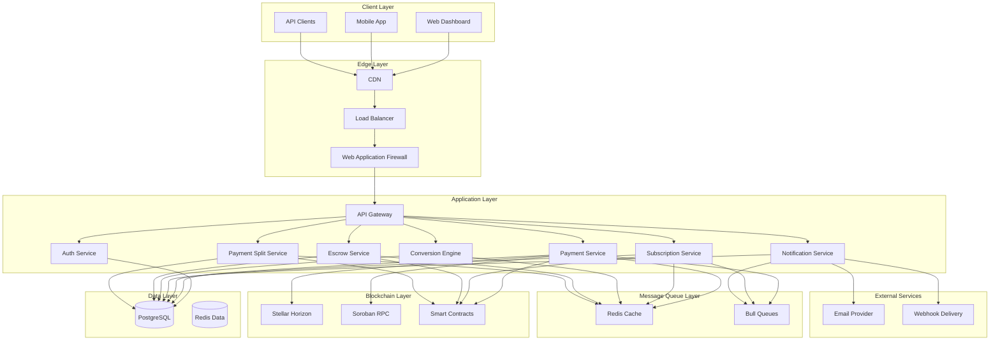
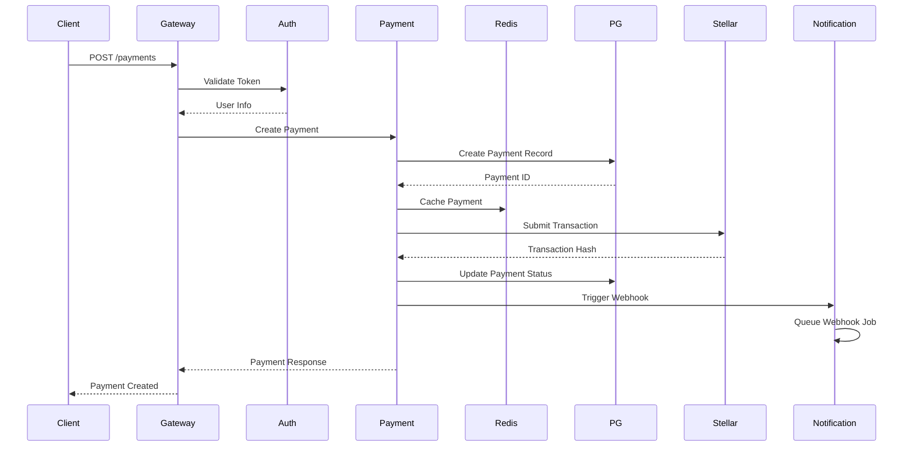
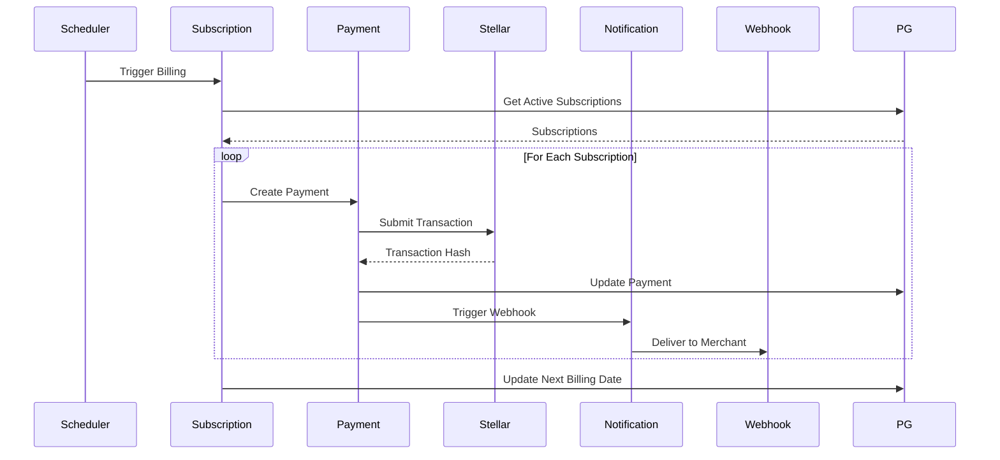
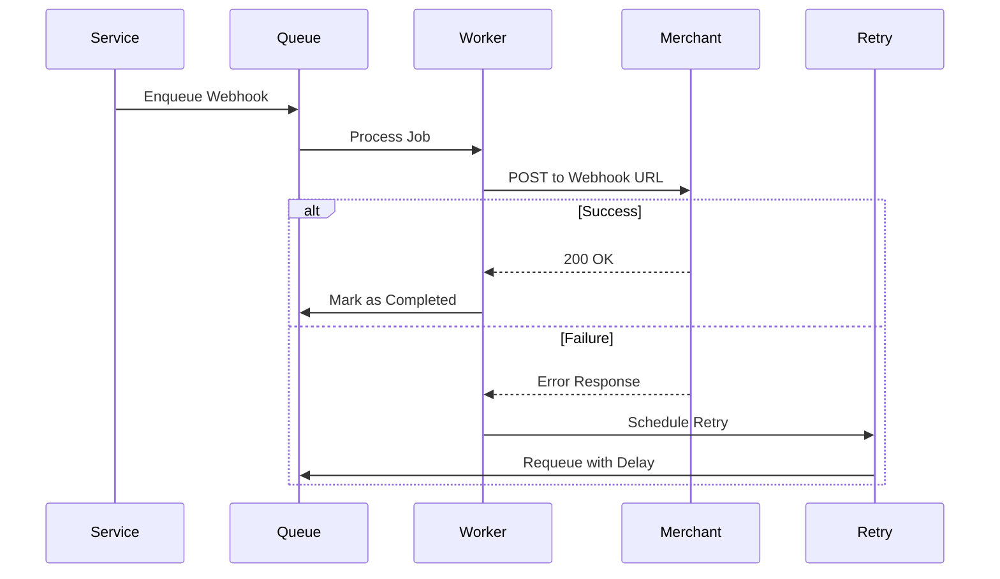
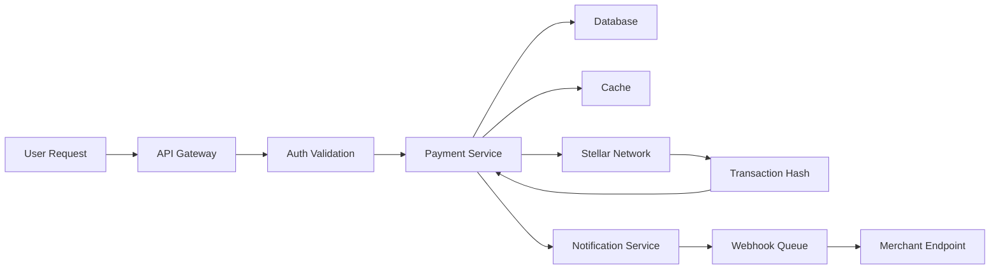
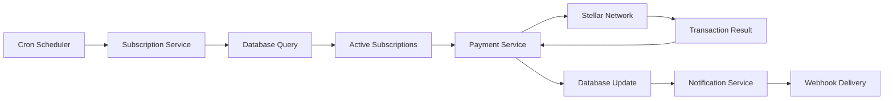
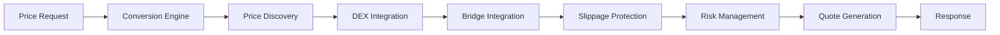
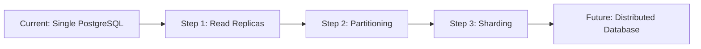
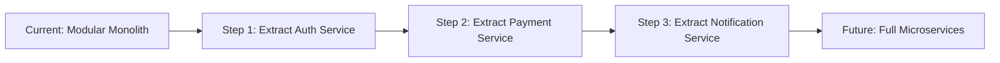
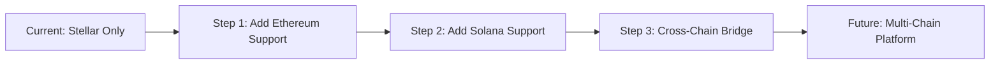

# Paya System Architecture

## Table of Contents
1. [High-Level Architecture](#high-level-architecture)
2. [Component Interaction Diagrams](#component-interaction-diagrams)
3. [Data Flow Diagrams](#data-flow-diagrams)
4. [Technology Stack Rationale](#technology-stack-rationale)
5. [Design Patterns](#design-patterns)
6. [Trade-offs and Alternatives](#trade-offs-and-alternatives)

## High-Level Architecture

### System Overview

Paya is a crypto payment infrastructure built on the Stellar network, designed to handle payments, subscriptions, escrow, and payment splits with high availability and security.

### Architecture Diagram



### Layer Responsibilities

#### Client Layer
- **Web Dashboard**: React-based dashboard for merchants
- **Mobile App**: Mobile application for end-users
- **API Clients**: Third-party integrations using REST API

#### Edge Layer
- **CDN**: Static asset delivery and DDoS protection
- **Load Balancer**: Traffic distribution across instances
- **WAF**: Security filtering and attack prevention

#### Application Layer
- **API Gateway**: Request routing, authentication, rate limiting
- **Auth Service**: User authentication and authorization
- **Payment Service**: Payment processing and management
- **Subscription Service**: Recurring billing management
- **Notification Service**: Webhook and email notifications
- **Conversion Engine**: Currency conversion and price discovery
- **Escrow Service**: Escrow payment management
- **Payment Split Service**: Multi-recipient payment splitting

#### Message Queue Layer
- **Redis Cache**: Caching and session storage
- **Bull Queues**: Asynchronous job processing

#### Data Layer
- **PostgreSQL**: Primary relational database
- **Redis Data**: Key-value storage for caching

#### Blockchain Layer
- **Stellar Horizon**: Stellar network API
- **Soroban RPC**: Smart contract interaction
- **Smart Contracts**: On-chain payment logic

#### External Services
- **Email Provider**: Transactional email delivery
- **Webhook Delivery**: Merchant webhook notifications

## Component Interaction Diagrams

### Payment Creation Flow



### Subscription Billing Flow



### Webhook Delivery Flow



## Data Flow Diagrams

### Payment Data Flow



### Subscription Data Flow



### Conversion Data Flow



## Technology Stack Rationale

### Backend Framework: NestJS

**Rationale:**
- Built-in dependency injection
- Modular architecture
- TypeScript support out of the box
- Excellent testing support
- Large ecosystem of modules

**Alternatives Considered:**
- Express.js: Too minimal, requires more boilerplate
- Fastify: Faster but smaller ecosystem
- Koa: Less opinionated, requires more setup

### Database: PostgreSQL

**Rationale:**
- ACID compliance for financial transactions
- Excellent JSON support for metadata
- Strong reliability and performance
- Advanced features (indexes, constraints, triggers)
- Mature tooling and monitoring

**Alternatives Considered:**
- MySQL: Good but less advanced features
- MongoDB: No ACID guarantees, not suitable for financial data
- CockroachDB: Distributed but more complex

### Cache: Redis

**Rationale:**
- In-memory performance
- Rich data structures
- Pub/Sub for real-time features
- Persistence options
- Excellent for session storage

**Alternatives Considered:**
- Memcached: Simpler but fewer features
- In-memory cache: Not distributed, no persistence

### Message Queue: Bull

**Rationale:**
- Redis-based, no additional infrastructure
- Built-in retry logic
- Job scheduling
- Web UI for monitoring
- Good NestJS integration

**Alternatives Considered:**
- RabbitMQ: More powerful but more complex
- Kafka: Overkill for this use case
- AWS SQS: Cloud-specific, adds latency

### Blockchain: Stellar

**Rationale:**
- Fast transactions (3-5 seconds)
- Low fees
- Built-in decentralized exchange
- Smart contract support (Soroban)
- Stable and mature network

**Alternatives Considered:**
- Ethereum: High fees, slow transactions
- Solana: Faster but less mature
- Polygon: Good but less decentralized

### Frontend: React + TypeScript

**Rationale:**
- Large ecosystem and community
- TypeScript for type safety
- Excellent developer experience
- Component reusability
- Good performance with optimization

**Alternatives Considered:**
- Vue.js: Good but smaller ecosystem
- Angular: More opinionated, steeper learning curve
- Svelte: Newer, smaller ecosystem

## Design Patterns

### Repository Pattern

Used for database access:

```typescript
@Injectable()
export class PaymentRepository {
  constructor(
    @InjectRepository(Payment)
    private repository: Repository<Payment>,
  ) {}

  async findById(id: string): Promise<Payment> {
    return this.repository.findOne({ where: { id } });
  }

  async create(data: CreatePaymentDto): Promise<Payment> {
    const payment = this.repository.create(data);
    return this.repository.save(payment);
  }
}
```

**Benefits:**
- Separation of concerns
- Testability
- Centralized data access logic

### Factory Pattern

Used for creating different payment types:

```typescript
@Injectable()
export class PaymentFactory {
  createPayment(type: PaymentType, data: PaymentData): Payment {
    switch (type) {
      case PaymentType.STANDARD:
        return new StandardPayment(data);
      case PaymentType.SUBSCRIPTION:
        return new SubscriptionPayment(data);
      case PaymentType.ESCROW:
        return new EscrowPayment(data);
      default:
        throw new Error('Invalid payment type');
    }
  }
}
```

**Benefits:**
- Encapsulates object creation logic
- Easy to add new payment types
- Centralized creation logic

### Strategy Pattern

Used for different payment processors:

```typescript
interface PaymentProcessor {
  process(payment: Payment): Promise<PaymentResult>;
}

class StellarProcessor implements PaymentProcessor {
  async process(payment: Payment): Promise<PaymentResult> {
    // Stellar-specific logic
  }
}

class StripeProcessor implements PaymentProcessor {
  async process(payment: Payment): Promise<PaymentResult> {
    // Stripe-specific logic
  }
}
```

**Benefits:**
- Interchangeable algorithms
- Easy to add new processors
- Open/closed principle

### Observer Pattern

Used for webhook notifications:

```typescript
@Injectable()
export class WebhookNotifier {
  private observers: WebhookObserver[] = [];

  register(observer: WebhookObserver) {
    this.observers.push(observer);
  }

  async notify(event: WebhookEvent) {
    for (const observer of this.observers) {
      await observer.handle(event);
    }
  }
}
```

**Benefits:**
- Loose coupling
- Easy to add new observers
- Event-driven architecture

### Circuit Breaker Pattern

Used for external service calls:

```typescript
@Injectable()
export class StellarCircuitBreaker {
  private failures = 0;
  private lastFailureTime = 0;
  private state = 'CLOSED';

  async execute(fn: () => Promise<any>): Promise<any> {
    if (this.state === 'OPEN') {
      throw new Error('Circuit breaker is open');
    }

    try {
      const result = await fn();
      this.onSuccess();
      return result;
    } catch (error) {
      this.onFailure();
      throw error;
    }
  }

  private onSuccess() {
    this.failures = 0;
    this.state = 'CLOSED';
  }

  private onFailure() {
    this.failures++;
    if (this.failures >= 5) {
      this.state = 'OPEN';
      this.lastFailureTime = Date.now();
    }
  }
}
```

**Benefits:**
- Prevents cascading failures
- Automatic recovery
- Configurable thresholds

## Trade-offs and Alternatives

### Monolith vs Microservices

**Decision: Modular Monolith**

**Rationale:**
- Easier to develop and test
- Lower operational complexity
- Can split into microservices later if needed
- Shared database simplifies transactions

**Trade-offs:**
- Less isolation between modules
- Single point of failure
- Harder to scale individual components

**Migration Path:**
- Extract services as needed
- Use feature flags for gradual migration
- Implement service boundaries early

### SQL vs NoSQL

**Decision: SQL (PostgreSQL)**

**Rationale:**
- ACID compliance required for financial data
- Complex queries and relationships
- Mature tooling and monitoring
- JSON support for flexible metadata

**Trade-offs:**
- Less flexible schema changes
- Vertical scaling limitations
- More complex sharding

**Migration Path:**
- Read replicas for scaling
- Partitioning for large tables
- Consider NoSQL for specific use cases (logs, analytics)

### Synchronous vs Asynchronous Processing

**Decision: Hybrid Approach**

**Rationale:**
- Synchronous for immediate responses
- Asynchronous for long-running operations
- Webhooks for event-driven updates

**Trade-offs:**
- Increased complexity
- Need for job queue infrastructure
- Eventual consistency

**Migration Path:**
- Start with synchronous
- Add queues for heavy operations
- Implement event sourcing if needed

### REST vs GraphQL

**Decision: REST API**

**Rationale:**
- Simpler to implement and document
- Better caching support
- Standard tooling
- Easier for third-party integrations

**Trade-offs:**
- Over-fetching/under-fetching data
- Multiple round trips for related data

**Migration Path:**
- Add GraphQL gateway if needed
- Keep REST for external APIs
- Use GraphQL internally for complex queries

### Centralized vs Distributed Configuration

**Decision: Environment Variables + Config Service**

**Rationale:**
- Simple for development
- Environment-specific overrides
- Secrets management integration

**Trade-offs:**
- Harder to manage across environments
- No runtime configuration changes

**Migration Path:**
- Add configuration service for dynamic config
- Use feature flags for runtime changes
- Implement config versioning

## Performance Characteristics

### Latency Targets

| Operation | P50 | P95 | P99 |
|-----------|-----|-----|-----|
| Payment Creation | 100ms | 500ms | 1s |
| Payment Confirmation | 3s | 5s | 10s |
| Subscription Billing | 500ms | 2s | 5s |
| Webhook Delivery | 200ms | 1s | 2s |
| API Response | 50ms | 200ms | 500ms |

### Throughput Targets

| Metric | Target |
|--------|--------|
| Payments/Second | 1,000 |
| Subscriptions/Day | 100,000 |
| Webhooks/Second | 5,000 |
| API Requests/Second | 10,000 |

### Availability Targets

| Metric | Target |
|--------|--------|
| Monthly Uptime | 99.9% |
| Quarterly Uptime | 99.95% |
| Annual Uptime | 99.99% |
| RPO (Recovery Point Objective) | 5 minutes |
| RTO (Recovery Time Objective) | 1 hour |

## Known Limitations

### Current Limitations

1. **Stellar Network Dependency**
   - Dependent on Stellar network uptime
   - Network congestion affects transaction times
   - Mitigation: Multiple network support in future

2. **Single Region Deployment**
   - Currently deployed in single region
   - Geographic latency for distant users
   - Mitigation: Multi-region deployment planned

3. **Database Scaling**
   - Single PostgreSQL instance
   - Write bottleneck at high scale
   - Mitigation: Read replicas and partitioning

4. **Smart Contract Upgradeability**
   - Limited upgrade mechanisms
   - May require migration for major changes
   - Mitigation: Proxy pattern implementation

### Future Improvements

1. **Multi-Blockchain Support**
   - Add support for other blockchains
   - Cross-chain payments
   - Atomic swaps

2. **Advanced Analytics**
   - Real-time analytics
   - Machine learning for fraud detection
   - Predictive insights

3. **Enhanced Security**
   - Multi-sig support
   - Hardware wallet integration
   - Advanced KYC/AML

4. **Performance Optimization**
   - Edge computing
   - Database sharding
   - Advanced caching strategies

## Migration Paths

### Database Migration



### Service Migration



### Blockchain Migration



## Support

For architecture questions, contact:
- **Tech Lead**: tech-lead@paya.io
- **Architecture Team**: architecture@paya.io
- **Slack**: #paya-architecture
